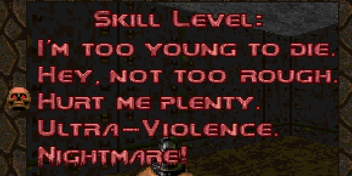

# Hurt Me Plenty

Date: 2015/07/15

Authors: [Mario Strahl](http://www.mariostrahl.de)

MaxWidth: 580px

---
---

_Hurt Me Plenty_ ist eine Soundinstallation, die sich damit beschäftigt, was passiert wenn eine Gruppe Fremder durch das Internet zusammengewürfelt wird und voneinander abhängig ist. Lediglich durch Ton und Text miteinander verbunden, schwindet die Hemmschwelle untereinander.
Diese "Unterhaltungen" auf neutralen Grund gebracht, ermöglicht uns eine andere Sichtweise auf das Verhalten der Gruppe und regt uns an, über unser eigenes Verhalten im Internet nachzudenken. 

<iframe width="100%" height="166" scrolling="no" frameborder="no" src="https://w.soundcloud.com/player/?url=https%3A//api.soundcloud.com/tracks/246689629%3Fsecret_token%3Ds-jfObe&amp;color=ff5500&amp;auto_play=false&amp;hide_related=false&amp;show_comments=true&amp;show_user=true&amp;show_reposts=false"></iframe>

__Thanks To:__  
_Slavchogut , ras , Jefè | Pàgen.se , MML , Hylken , SATANJOEL , Woodkid , aZ , Mr. Knister , Liquidius Snake , HoRNeDtriceps , WAAAAJAJAJAJAJJ , Rouxi , Qwca4te , chauklet ! , Pablito , Light}night , Jonizo , d0lphin , aKu *sensei , DesAster , Sl1xx , bumpp , Tlk26 , OTG , DAWG , Evdok , Daniels , Pottermeister , Me being awesome , Malinus , Simplify. , wurocky , Dagobert ischör , fR1b3rg'$ L3fT NIPp1e , topparn	 , wavesplash , clAssic. , Thorin , Pidjaaaaaaaaa , noddbert , juarez , fet grek , A$AP &L , MOM PLS , Exz , Freedom , maikkelpro , 7yler Durden , THEdooM #ROAD TO GLOBAL , chopper , y0rke , eastpacK1337* , mecemecemece , deupiA+ , dfq , dixoN' , E.G.S. , frnzyboii , Kitowiec , KaptainKush , Zix0000 , xartEN! , attacKkk , conscious , Phantom , red-dog , braah , Fishermeister , sportmw , Andi , nighty , Extra.Nance , arnyz:)_

---

Rundgang 2015, Kunsthochschule Kassel

