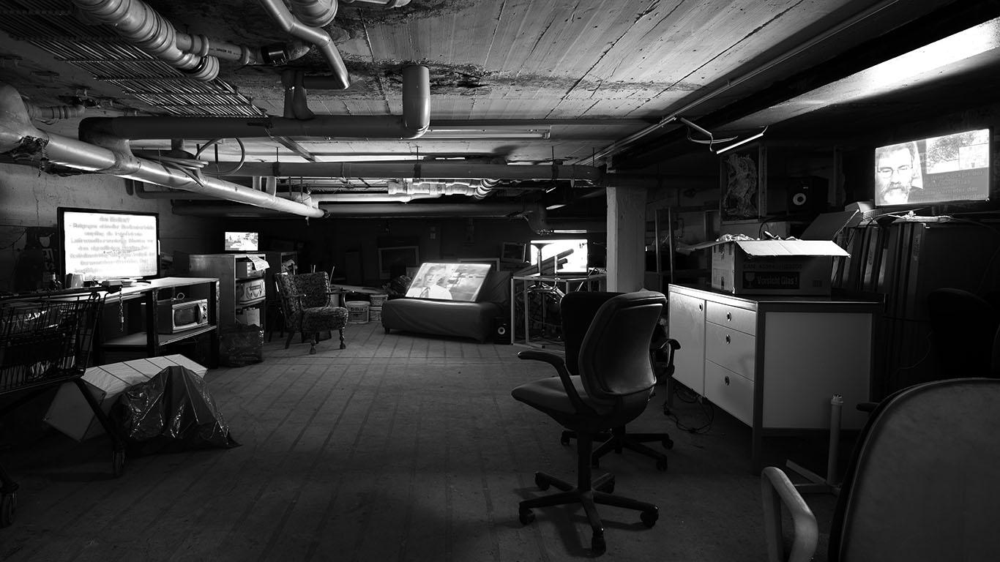

# Real-Time Propaganda

Date: 2015/07/15

Authors: [Mike Huntemann](http://www.mikehuntemann.de)  
Keywords: real, time, propaganda, youtube, nsa, ebola, germanwings, charlie hebdo, mh370, media, mike huntemann, jörn röder

---
---

Die Arbeit “Real-Time Propaganda” fasst fünf massenmediale Ereignisse der Nachrichtenlandschaft der letzten zwei Jahre automatisiert zusammen.

Auf der Suche nach Youtube-Videos zu den fünf Themen NSA, Ebola, Charlie Hebdo, Germanwings Absturz und MH370 greift ein Algorithmus auf die Technik der automatisierten Spracherkennung zurück – eine Technologie, mit der große Internetkonzerne und Geheimdienste die in der Masse verfügbaren Inhalte automatisiert analysieren, klassifizieren und filtern. 

In einem 13-minütigen Loop werden die so gefundenen Videoausschnitte von einem Algorithmus dramaturgisch entsprechend der für Massenmedien typische Trendkurve auf die Videokanäle verteilt. 

Durch die asymmetrische Verteilung der Monitor-Lautsprecher-Paare in der mehrkanaligen Installation kann der Betrachter seinen Blick nicht fokussieren, sondern wird durch den dadurch entstehenden Surroundsound dazu verleitet, seinen Blickwinkel stetig zu verändern.

---

Ausgestellt am Rundgang 2015, [Kunsthochschule Kassel](http://www.kunsthochschulekassel.de)  
Gewinner des Rundgangspreis 2015 (SV SparkassenVersicherung)  
Künstlerische Beratung durch [Jörn Röder](http://www.joernroeder.de) und Gastprofessor [Hans Bernhard](http://www.ubermorgen.com)
 
