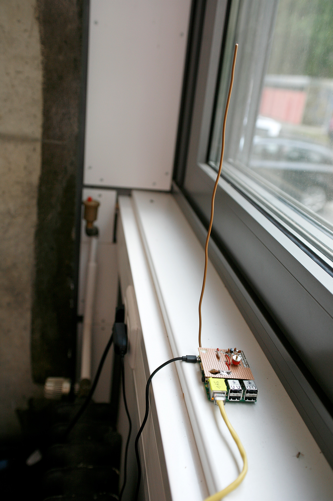
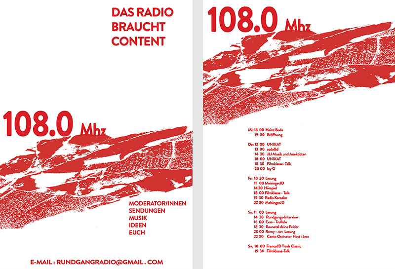
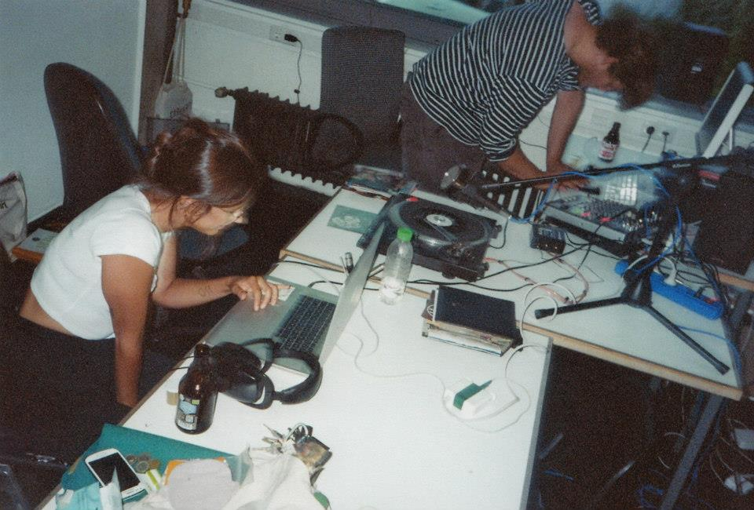
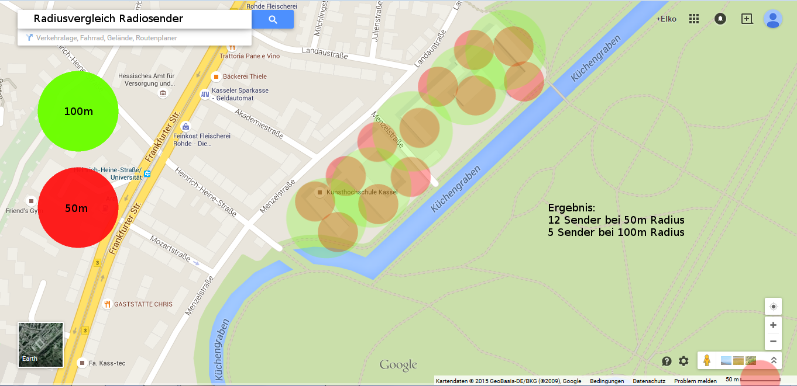

# Rundgangsradio

Date: 2015/07/01

Authors: Elko Brass

---
---

_Rundgangsradio_ ist ein FM-Radiosender mit begrenzer Reichweite der während des Rundgangs 2015 sendete.

5 Raspberry Pis mit Antennenplatine – 5 Tage NonStop Programm.

<iframe width="100%" height="60" src="https://www.mixcloud.com/widget/iframe/?feed=https%3A%2F%2Fwww.mixcloud.com%2F108_Mhz_RGR%2F&hide_cover=1&mini=1&light=1" frameborder="0"></iframe>