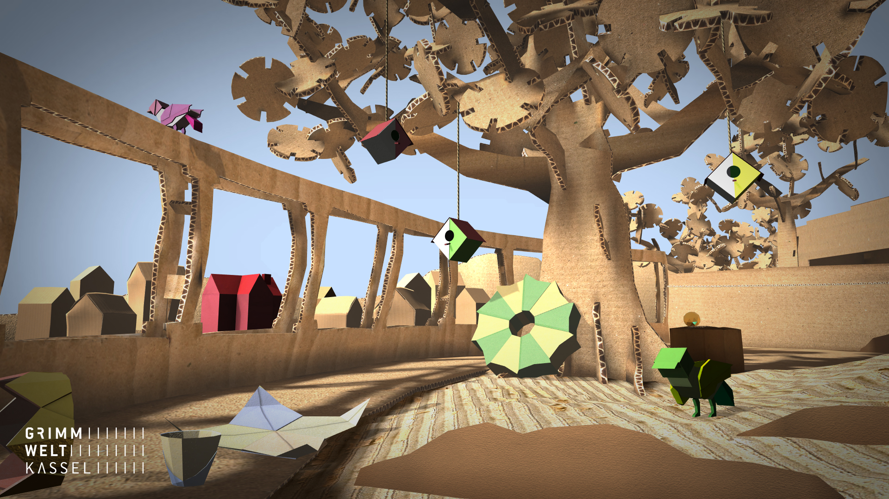
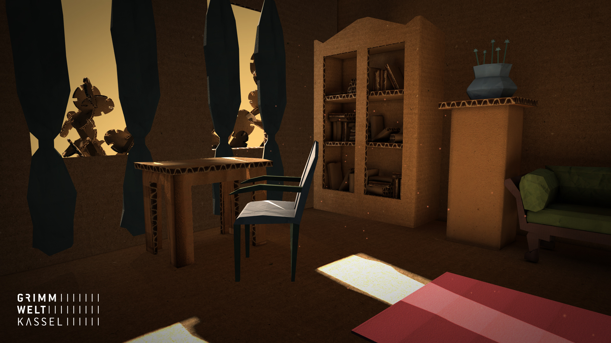

# Klickhüpfguck

Date: 2015/09/07

Authors: [Isabel Paehr](http://www.isabelpaehr.de), [Jasper Meiners](http://www.jaspermeiners.de)

---
---

Klickhüpfguck is a game for Grimmwelt Kassel, a museum opened in september 2015 about the oevre of the Grimm brothers, who were famous German fairy tale collectors and two of the first and most influencial linguists.

In the game, you enter a papermade version of our hometown Kassel, which got kind of mixed up with fairy tale elements. While clicking through different sets, you can discover small notes, that give you information about the Grimms lifes, work and the museums exhibition. 

‘Grimmwelt’ indeed provides not only information: While playing, future visitors can find the way up from Weinberg Kassel to the Grimmwelt museum, engage with the themes of the Grimms, and are the ones, who finally enlighten the building.

---

---
You can play the game on the website of [Grimmwelt](http://www.grimmwelt.de/grimmwelt-kassel/entdecken/)

---