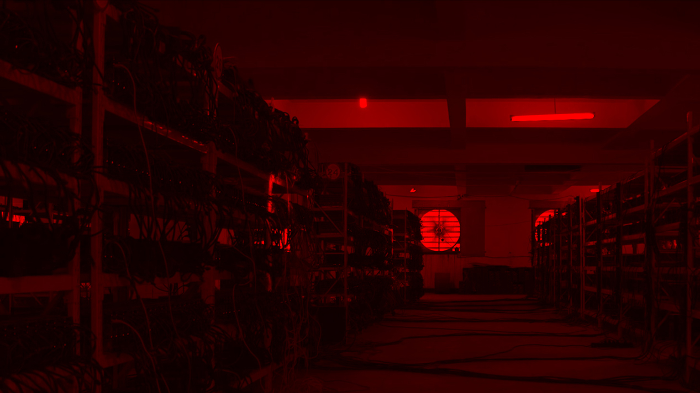

# Chinese Coin

Date: 2015/11/08

Authors: [UBERMORGEN](http://www.ubermorgen.com), [Mike Huntemann](http://www.mikehuntemann.de)

Keywords: chinese, coin, ubermorgen, ubermorgen.com, mike huntemann, 

---
---
<iframe src="https://player.vimeo.com/video/145141943?title=0&byline=0&portrait=0" width="500" height="281" frameborder="0" webkitallowfullscreen mozallowfullscreen allowfullscreen></iframe>

UBERMORGEN

Chinese Coin, 2015

Chinese Coin mining has recently made the People's Republic of China the world's largest Bitcoin producer. Mining requires exertion and it slowly makes new currency available at a rate that resembles the rate at which commodities like gold, copper, diamonds, nickel, rare earth, silver, uranium and zinc are mined from the ground. One of the reasons for the fast growth is the buildout of hydropower in the west of the country. The first petahash mining farms were built in Shanxi and Inner Mongolia where coal was cheap and plentiful, but cheap coal can’t compete with free water and now the farms are migrating en masse towards the west.  
[uuuuuuuntitled.com/chinesecoin](http://uuuuuuuntitled.com/chinesecoin) 

---
Production: UBERMORGEN  
Video & Sounddesign: Mike Huntemann  
Commissioned by NEoN (North East of North), 2015  
Optimized for Dolby Surround 5.1  

