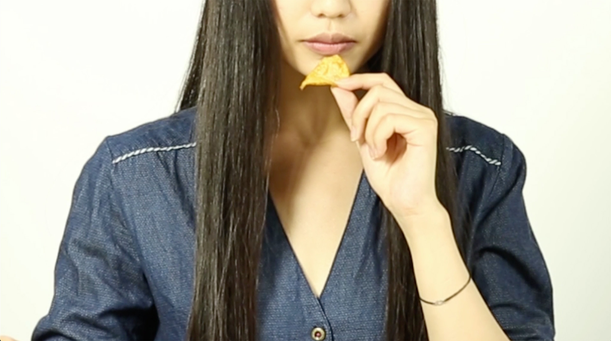

# ESSEN DIE STIMME

Date: 2015/11/20

Authors: Echo Can Luo

Keywords: video, sound, Atmosphere, Leib

---
---

<iframe src="https://vimeo.com/155112877" width="500" height="281" frameborder="0" webkitallowfullscreen mozallowfullscreen allowfullscreen></iframe>

Entweder, alles was wir gesehen haben und alles was wir gehört haben, ist nicht echt, oder beides ist echt.  
Der Mensch bekommt jeden Tag viele Informationen. Wir nehmen sie durch Sehen, Riechen, Schmecken oder Hören auf. Unsere Gedanken werden aus diesen Informationen und unseren Erfahrungen gebildet. Jeder kann die Informationen bekommen. Aber wenn jemand eine unlogische Information bekommt, was passiert dann? Ich mache eine mir vertraute Bewegung, aber dann höre ich das mir vertraute Geräusch nicht. Widerspruch. Was ich gesehen oder gehört habe, existiert so nicht in meinem Kopf. Meine Logik und meine Erinnerungen kann ich damit nicht verbinden.
Ich zweifle an Informationen, denn ich selbst habe immer Einfluss darauf.

