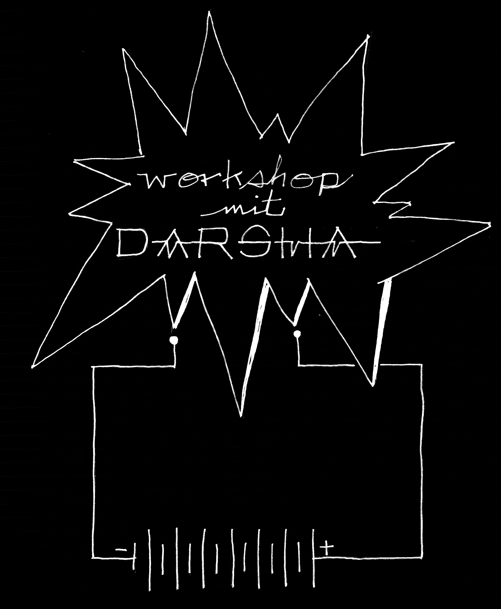

# How To Start a Fire with Dead Batteries and Clone the Internet with Garbage

Date: 2015/12/01

Authors: [Darsha Hewitt](http://darsha.org)

Type: Workshop

---
---

In diesem Workshop werden die Lichter erloschen sein.

Das Internet ist defekt.

Wir machen ein Feuer, so dass wir im Dunkeln sehen können.  

Wir bauen Werkzeuggürtel, so dass wir für Action bereit sind.

Vor Natur aus ist Müll unsere reichlich vorhandene Ressource.

Wir stellen Fragen an kaputte Maschinen, uns zu lehren wie wir zueinander in Beziehung stehen.

Wir zerlegen, beobachten, erkennen Muster und dokumentieren.

Wir folgen unseren eigenen Spuren, um herauszufinden, wie wir uns wieder verbinden.

__#wemakemachinesnotart__
