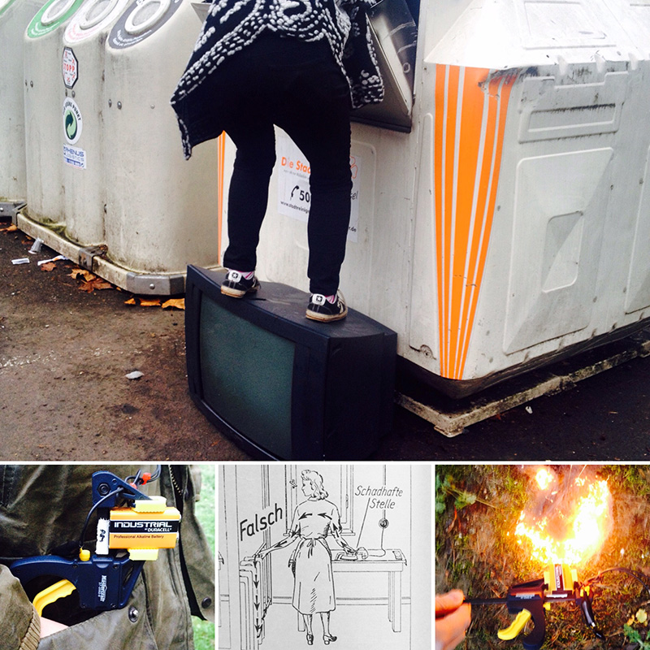

# How To Frankenstein a Circuit and (continue to) Rebuild the Internet out of Garbage

Type: Workshop

---
---

## Workshop with Darsha Hewitt

Congratulations - you have successfully extracted raw material from the Garbage -  You have built a beauty fire out of steel wool and science.  
You have stripped a Scanner it from its commercial duties and You have restored a Gigantic old Calculator and retraced its secret inner-universe with a schematic.

Now it is time to level up - connect broken things together to make strange functioning stuff.

If you like breaking things and the smell of burning dust then this workshop is for you!

More circuit building, more reverse engineering and more learning about how to (de/re)solder and use a multi-meter.