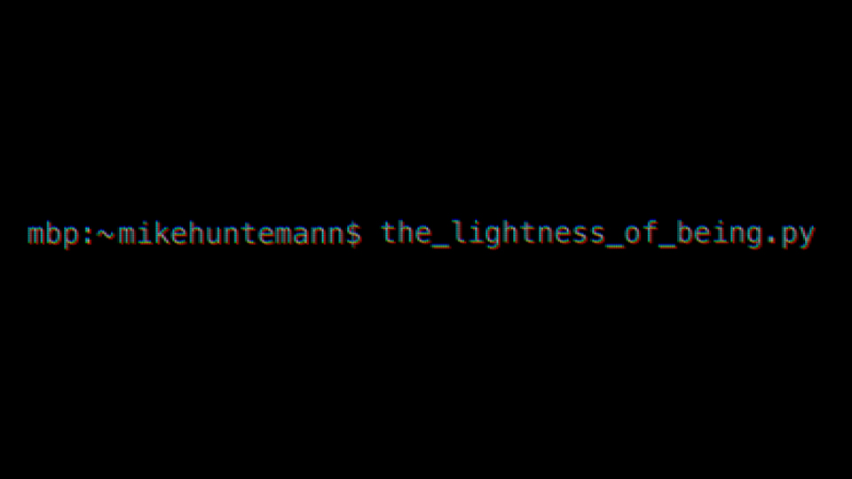

# Project Template

Date: 2016/01/25

Authors: [Mike Huntemann](http://www.mikehuntemann.de), [Jörn Röder](http://www.joernroeder.de)

Keywords: leichtigkeit, des seins, lightness, of being, mike, huntemann, jörn, röder, bamberg, bamberger, kurzfilmtage

---
---

Analog zur Installation [Real-Time Propaganda](http://newmediakassel.com/real-time-progropaganda) greift ein Algorithmus auf die Technik der automatisierten Spracherkennung zurück – eine Technologie, mit der große Internetkonzerne und Geheimdienste die in der Masse verfügbaren Inhalte automatisiert analysieren, klassifizieren und filtern. 

In einem 6-minütigen Film werden die so gefundenen Auschnitte aus Youtube-Videos zum Thema "Leichtigkeit des Seins" präsentiert.
  
---

In Kooperation mit [Bamberger Kurzfilmtage](http://www.bambergerkurzfilmtage.de)  
Premiere am Eröffnungsabend der 26. Bamberger Kurzfilmtage  
Künstlerische Beratung durch [Jörn Röder](http://www.joernroeder.de)

<iframe src="https://player.vimeo.com/video/152695178?title=0&byline=0&portrait=0" width="500" height="281" frameborder="0" webkitallowfullscreen mozallowfullscreen allowfullscreen></iframe>

