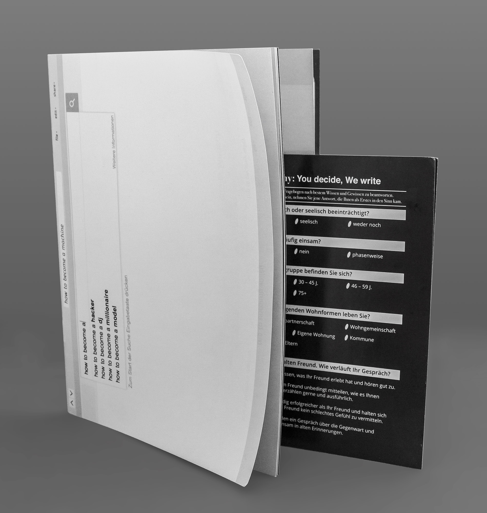
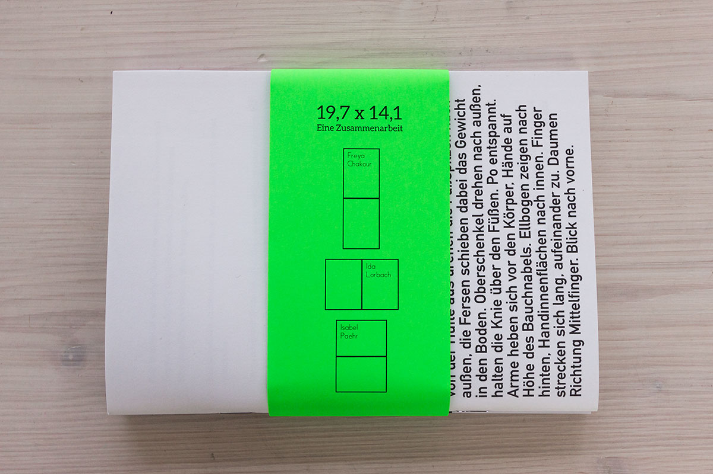
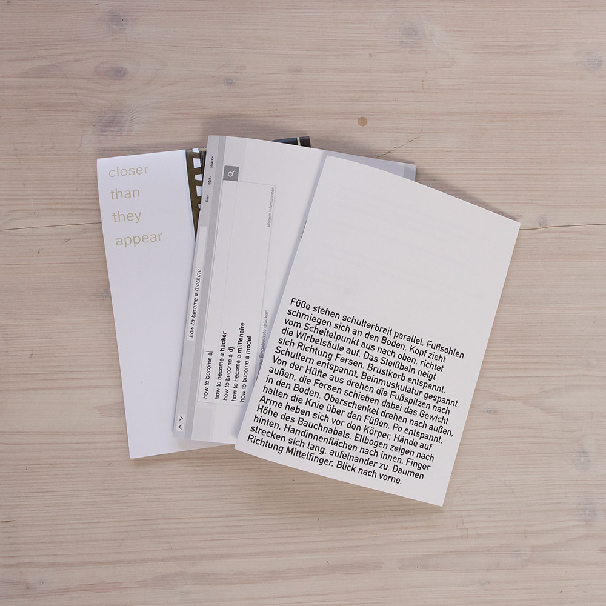

# how to become a machine

Date: 2016/03/01

Authors: [Isabel Paehr](http://www.isabelpaehr.de)

Keywords: robotics, robography, robolove corp, publication, tsu-i-17, 19.7 x 14.1, Zusammenarbeit

---
---

In *how to become a machine* beschäftige ich mich als Vertreterin der Firma *RoboLove Corp* mit zeitgenössischen und zukünftigen RoboterInnen, 
Mensch-Maschine-Schnittstellen/Oberfächen und (user-) Mitbestimmung. 

Das Printprodukt enthält sowohl erklärende Texte zu Grundbegriffen der Robotik, Texte und Bilder zu bekannten humanoiden RoboterInnen, Kurzgeschichten des Verlags *new books inc*, ein Interview mit der japanischen Kritikerin *FemRobo* und kritische Texte wie *Wer liest*. 
Letzterer stellt die Frage, wer die Leserin liest, während sie liest und untersucht Bots, die das Verhalten von UserInnen auswerten, um auf Partnervermittlungs-Seiten Menschen zu imitieren, Nachrichten zu veröffentlichen oder zu twittern. 

LeserInnen ist es möglich, über einen Fragebogen mit der Firma *Robography* in Kontakt zu treten und sich eine Biographie für ihre_n zukünftigen RoboterIn generieren zu lassen.


Die Publikation umfasst 28 Seiten und enthält sowohl Texte als auch visuelle Materialien. How to become a machine soll als Werbebroschüre für RoboLove Corp eingesetzt werden und kann auf Twitter unter @RoboLove_Corp [@RoboLove_Corp](https://twitter.com/RoboLove_Corp) weiterverfolgt werden.
  
---

---

how to become a machine wird mit den Publikationen *Objects are closer than they appear* von Freya Chakour und *Position 1* von Ida Lorbach herausgegeben. Die drei Hefte vereint das Format 19.7 x 14.1 cm, das von den drei Künstlerinnen unterschiedlich interpretiert wird. 

Gemeinsames Thema ist Text als Medium für Verständigung und Missverständnisse, für Überwachung, Erinnerung und Identitätsbildung in Verbindung mit Filmbildern, wissenschaftlicher & künstlerischer Sprache, Hardware, Software und (Buch-)Raum. 

---

---
