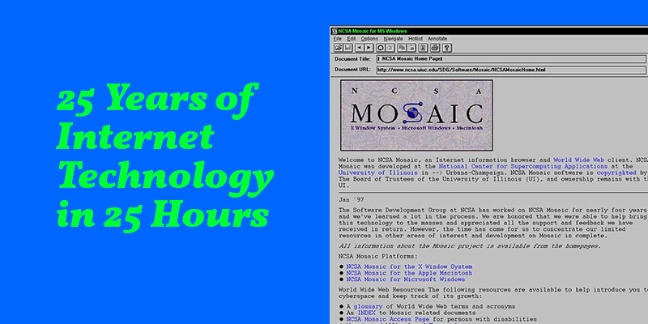

# 25 Years of Internet Technology in 25 Hours

Date: 2016/04/01
Authors: [Jörn Röder](http://joernroeder.de)
Type: Workshop

---
---

In _25 Years of Internet Technology in 25 Hours_ nehmen wir Platz in der Achterbahn, die uns durch den Technologie-Dschungel der Webtechnologien führt – dessen Evolution den momentanen Stand des Internets darstellt. Die 5 Sitzungen, die in je zwei Teile gegliedert sind, beginnen Vormittags mit den Neuerungen der technischen Entwicklung, dem angestrebten Fortschritt und politischen sowie sozialen Auswirkungen des jeweiligen Jahrfünfts.
 
Am Nachmittag folgt eine Hands-On-Session, in der die neu kennengelernten Technologien eigenständig erforscht, bestehende Projekte um diese erweitert oder neue Projekte entwickelt und Experimente gemacht werden können.

Die 25 Stunden bieten somit auch einen Zugang für interessierte – aber unerfahrene – Coder, die einen praktischen Einstieg in die Technologien des Internets suchen.
 
Die Sitzungen folgen der technischen Entwicklung und bauen somit aufeinander auf.

- __Episode 1: 1990-1995__ Freitag, 29.4.16 von 10-16 Uhr im Seminarraum (R311)
- __Episode 2: 1995-2000__ Freitag, 13.5.16 von 10-16 Uhr im Seminarraum (R311)
- __Episode 3: 2000-2005__ Freitag, 10.6.16 von 10-16 Uhr im Seminarraum (R311)
- __Episode 4: 2005-2010__ Freitag, 24.6.16 von 10-16 Uhr im Seminarraum (R311)
- __Episode 5: 2010-2015__ Freitag, 1.7.16 von 10-16 Uhr im Seminarraum (R311)
 
__Keywords__  Website, HTML, Frontpage, Dreamweaver, Netzpolitik, PHP, Wordpress, CSS, Internet Of Things, Web 2.0, Ajax, Blog, Blogger, Forum, 4Chan, reddit, Cloud, Javascript, Altavista, Netzneutralität, PGP, Krypto, HTTP, VPN, Proxy, SQL, Torrent, Limewire, NoSQL, Netscape, Napster, Friefox, Chrome, Flash, Wiki, Kazaa, JSON, ActionScript, Geocities, Guestbook, Semantic Web, Search Engine, Open-Source, Mobile First, Responsive, AIRA, Screen Reader, Tor, Darknet, Barrierearm, SASS, LESS, W3C, Machine Learning, Bots, Bitcoin, ES2015
