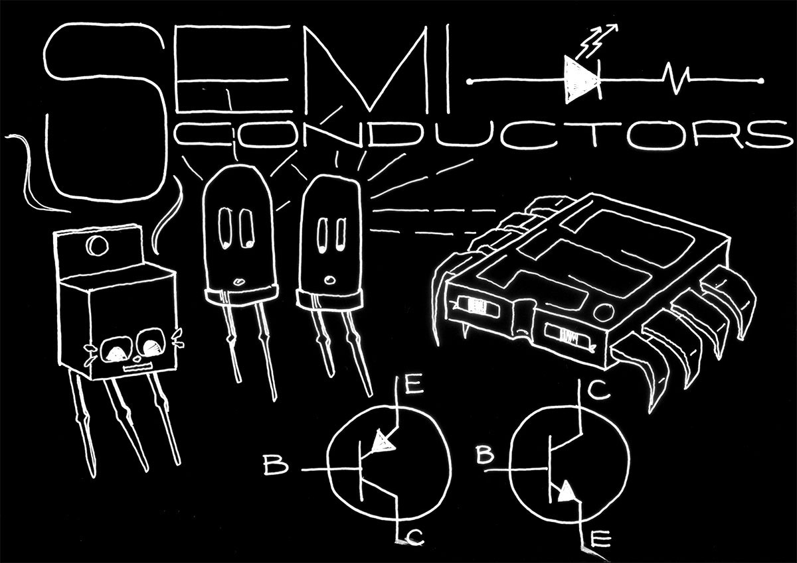

# DIY Electronic Sound Experiment

Date: 2016/04/01
Type: Workshop
Authors: [Darsha Hewitt](http://darsha.org)
Keywords: DIY electronics, hacking, synthesizers, reverse engineering, soldering, circuit boards, experimental sound, sound synthesis
ShowInTicker: true

---
---

_Neue Medien_ has a new and really fun electronics lab! _DIY Electronic Sound Experiment_ is an extended intro to electronics workshop where students learn to work with electricity on a elemental level by fabricating really crazy sound generating circuits. In each session students explore the basics of electronic hardware by buliding up small modules that can be connected and used as experimental instruments for music, sound art, sound installation and even as noisy interfaces that control things on a computer (such as video games, internet stuff and a lot more). The idea of this by-weekly event is to have fun with electronics and to invent interfaces and sounds that look and sound like weird miracles from another planet. 

__Important!!!__ You do not need to have any experience with electronics or music to get involved in this course - in fact, it might be better if you don't! We are not engineers and we are not trying to re-invent Kraftwerk. We are more interested in an intuitive approach to making and hacking and discovering new forms of expression that go beyond art genres and boundaries (this means that failures are as fortuitous as non-failures). This is a drop-in style program so, you can come and go as you please. 

__Keywords__  
DIY electronics, hacking, synthesizers, reverse engineering, soldering, circuit boards, experimental sound, sound synthesis

## Where and When?

_DIY Electronic Sound Experiment_ takes place every second Wednesday starting on 27.04.2016 from 13h-17h in R311

## More Infos

Find information about each workshop [here](https://piratenpad.de/p/jPfqcgb8d07Xttk), including schematics, materials, links to technical information and tutorials. It will be updated on a regular basis so check it out throughout the semester!!