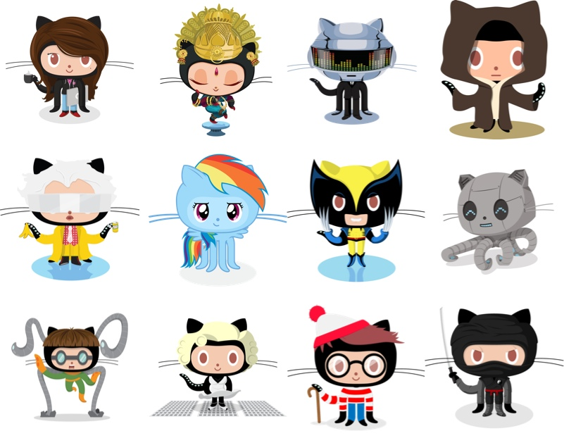

# git – Write Software Together!

Date: 2016/04/28
Authors: [Jörn Röder](http://joernroeder.de)
Type: Workshop
Keywords: code, collaboration, open source, version history, testing, fixing, branching, experimenting
ShowFullDate: true

---
---

Der Workshop _git – Write Software Together!_ erläutert die Vorzüge von `git` der verteilten Versionsverwaltung von Dateien und dem darum entstandenen Ökosystem. Welche Vorzüge entstehen beim Entwickeln, Diskutieren, Testen, Ausprobieren, Fixen, Publishen von Quellcode alleine – vor allem aber in einer Gruppe? In dem eintägigen Workshop vermittle ich die Funktionsweisen und Ideen von `git`, zeige Verbesserungen des Workflows auf und helfe euch `git` in eure eigenen Projekte (Processing, Unity, Arduino, InDesign Script, Web etc.) zu integrieren.

Bitte registriert euch im voraus bei [github.com](https://github.com) und installiert `git` sowie den github-Client auf eurem System:

- [https://git-scm.com/downloads](https://git-scm.com/downloads)
- [http://desktop.github.com/](http://desktop.github.com/)

__Keywords__  
code, collaboration, open source, version history, testing, fixing, branching, experimenting