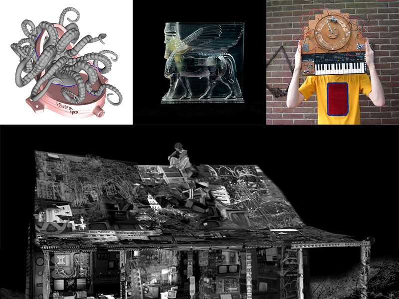

# International Artist Talk / Workshop Series

Date: 2016/05/01
Type: Lecture, Workshop, Performance
ShowInTicker: true

---
---

SoSe2016 - NM presents a talk and workshop series that explores Media Archeology as an artistic approach and Critical Material Practices.

---

## [Morehshin Allahyari](http://www.morehshin.com/) `[Iran/USA]` & [Daniel Rourke](http://machinemachine.net/) `[UK]`
### #Additivism // An Encounter with The Fluid Outside

- 11-12.05 / 11:00-16:30 / Workshop: 3D Fabrication as Critical Framework  
- 11.05 / 18:00-20:00 / Talk  / Papier Café

__Keywords:__  
3D printing, 3D Additivist Manifesto, Donna Harraway, technocapitalism, crude oil, Accelerationist, Xenofeminist, environmental ethics, objects in movements for social and political change 

[More Infos](/additivism)

---

## [Lauren Moffatt](http://www.fact.co.uk/people/artists/lauren-moffatt.aspx) `[Australia/Germany]`
### Oculus Reason // Experiencing Archives in Virtual Environments

- 9-10.6 / 11:00-16:00 / Workshop: Photogrammetrie for Oculus Rift / R311
- 9.6 / 18:00-20:00 / Talk /  Papier Café

__Keywords:__  
storytelling in 3D environments, video, game environments, moving image, history of Cinema, immersive technologies

---

## [Gijs Gieskes](http://www.fact.co.uk/people/artists/lauren-moffatt.aspx) `[Netherlands]`

### Re-appropriating/Re-inventing consumer technology for Sound 

- 22-23.06 / 11:00-17:00 / Workshop: Mechanical Sound Interfaces
- 23.06 / 21:00-23:00 / Performance / Location to be announced

__Keywords:__  
Hybrid-systems, sound art, performance, hardware hacking, gameboy hacks, spinning photoelectronic acid machine, retro-computing, circuit-bending, diy electronics, inventive interfaces for VJ/DJ/Audio Production 