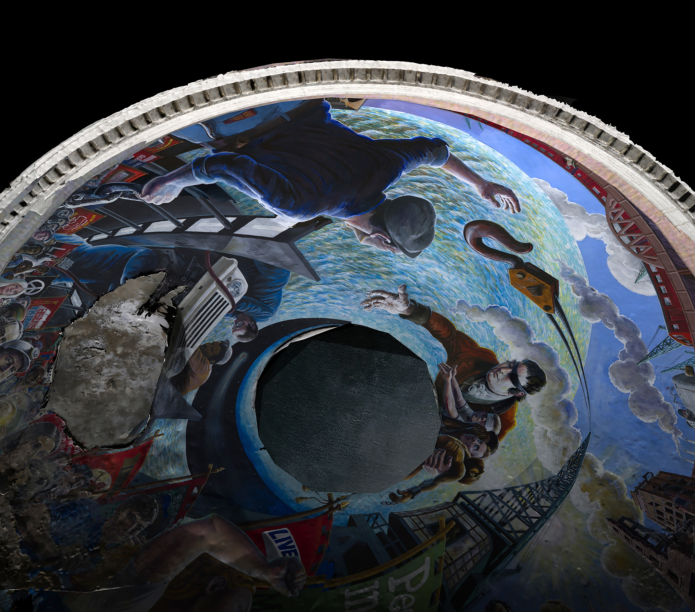

# The Oculist Reason

Date: 2016/06/09
Type: Lecture, Workshop
Authors: [Lauren Moffatt](http://deptique.net/)
Keywords: storytelling in 3D environments, video, game environments, animation, moving image, history of Cinema, immersive technologies, archives in digital environments

---
---

## Archives in Virtual Environments

Lauren Moffatt (b. 1982) is an Australian artist working between video, performance and immersive technologies. Her works, often presented in multiple forms, explore contemporary subjectivity and connected bodies as well as the limits between virtual and physical worlds. Over a number of years she has developed a body of work pivoting on stereoscopic photography and video and informed by the history of cinema and broadcast technologies.

Lauren is interested in how the dimension of depth in moving image can be used as a storytelling device. Her works have been screened and exhibited most recently at Museum Dr. Guislain, SAVVY Contemporary, FACT Liverpool, the Werkleitz Festival and at the ZKM in Karlsruhe. Lauren completed her studies at the College of Fine Arts in Sydney, Paris VIII University and Le Fresnoy Studio National des Arts Contemporains. She currently lives and works in Berlin. 

---

## Talk

__09.06.16 // 18h-20h // Papiercafé__

Lauren will present her work in stereoscopic film and interactive 360° documentary, outlining the hurdles she has faced and introducing the main aspects of the medium compared to 2D media. Students will be invited to experience content and learn about the different techniques for production and presentation, and how they affect storytelling, interactivity and distribution channels.

---

## Workshop: Photogrammetry for Virtual Reality

- 09.06.16 // Day 1 // 11-16h
- 10.06.16 // Day 2 // 11-16h

This a two day workshop where students will produce photogrammetry assets and learn how to integrate them in a simple Unity project for export either as an application or as a 360° film. Students are also encouraged to bring their own projects to the workshop for consultation. This workshop is open to everyone - no previous experience is required.

### Enrolment

If you would like to attend please send a short motivation letter (4 sentences maximum) on why you are interested - email: [darsha.hewitt@uni-weimar.de](mailto:darsha.hewitt@uni-weimar.de). Hand this in before 8 June 2016. Participants must attend the full 2 day programme! 

---

## More To Read

- [deptique.net](http://deptique.net/)
