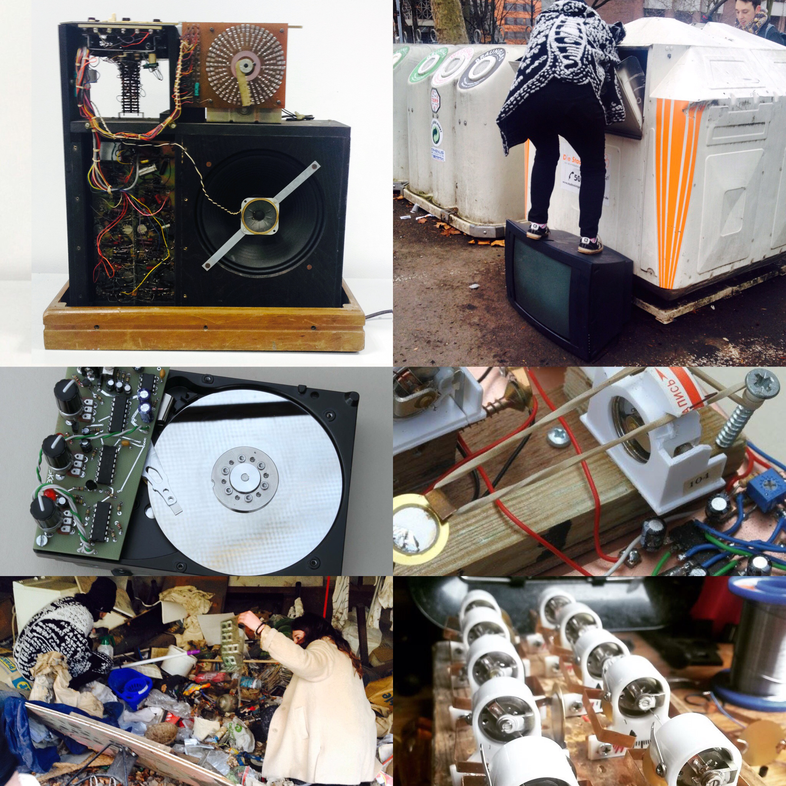

# Dumpster Drum Machine

Date: 2016/06/22
Type: Performance, Workshop
Authors: [Gijs Gieskes](http://gieskes.nl/)
Keywords: Media Archeology, DIY electronics, Sound Art, Experimental Music, circuit design

---
---

Gijs Geiskes is a industrial designer from the Netherlands specializing in the design of electronic devices, for audiovisual use. The devices are often sold as kits but also pre assembled. He does workshops, exhibitions, demonstrations and concerts with my machines, and sometimes works for artists when they need something they cannot make themselves.

---

## Workshop

- 22.06.16 // Day 1 // 11-17h
- 23.06.16 // Day 2 // 11-17h

This is a two day workshop where students will work together 'Factory Style' to build up re-invented models of the Side Man 5000 (the world's oldest commercial drum machine) out of electronics from the trash. No previous experience with electronics is necessary but students are encouraged to watch these tutorials before the workshop: http://sideman5000.org/ 

### Enrolment

If you would like to attend please send a short motivation letter (4 sentences maximum) on why you are interested - email: [darsha.hewitt@uni-weimar.de](mailto:darsha.hewitt@uni-weimar.de). Hand this in before 22 June 2016. Participants must attend the full 2 day programme! 

---

## NM GrillParty + Demos/Performances

__23.06.16 // 21h-23h // R311__

Join us for an evening of Wurst Demos and Performances!

---

## More To Read

- Here is info about Gijs: [http://gieskes.nl/](http://gieskes.nl/)
- Here is everything you need to know about sideman 5000: [www.sideman5000.org](http://www.sideman5000.org)
- Here is a real cool Invention called the Drum Buddy: [https://www.youtube.com/watch?v=vvtssL8WlJA](https://www.youtube.com/watch?v=vvtssL8WlJA)
