# map de_kunsthochschule

Date: 2016/07/13

Authors: [Nicole Brauer](https://www.google.com/#safe=off&q=nicole+brauer)

Keywords: installation, performance, generated, artificial intelligence, ai, counterstrike, cs, cs:go, kunsthochschule, kassel, killerspiele, ballerspiele, amok, terrorists, counter-terrorists, voyeurism, live, match

---
---

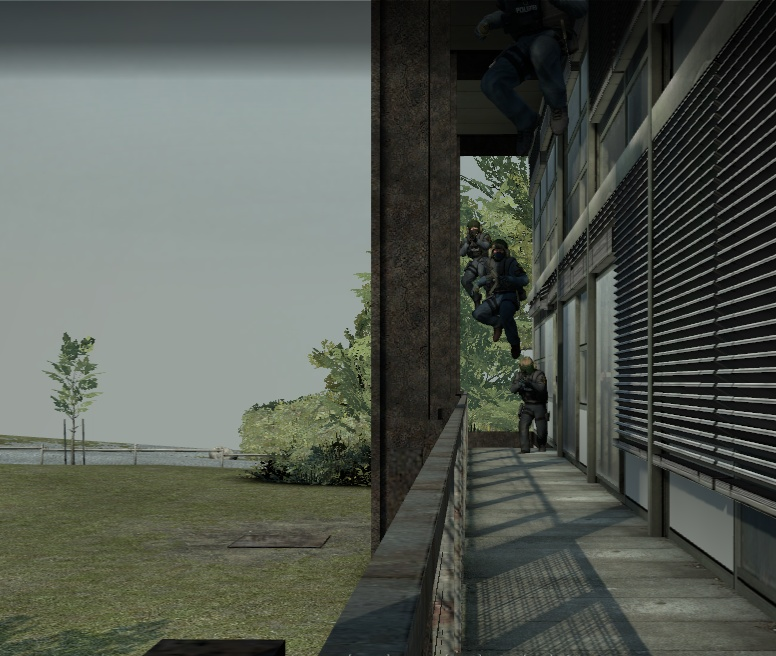

*map de_kunsthochschule* is a generative performance inside the videogame *Counter Strike: Global Offensive*, where the Kunsthochschule Kassel (School of Arts and Design in Kassel) acts as the scenery and battlefield for 10 AI-controlled characters while they are continousely pitted against each other in a never-ending live match.

(The game consists of 2 teams. The goal of the *terrorists* is to plant the bomb while the *counter-terrorists* have to prevent them from doing so. The game ends when the bomb explodes before it can be defused or when all enemies are eliminated.)

---

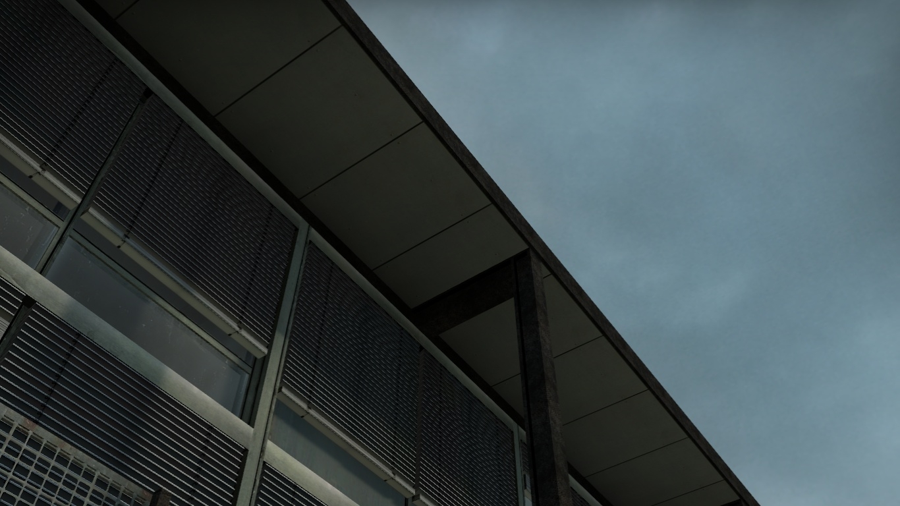

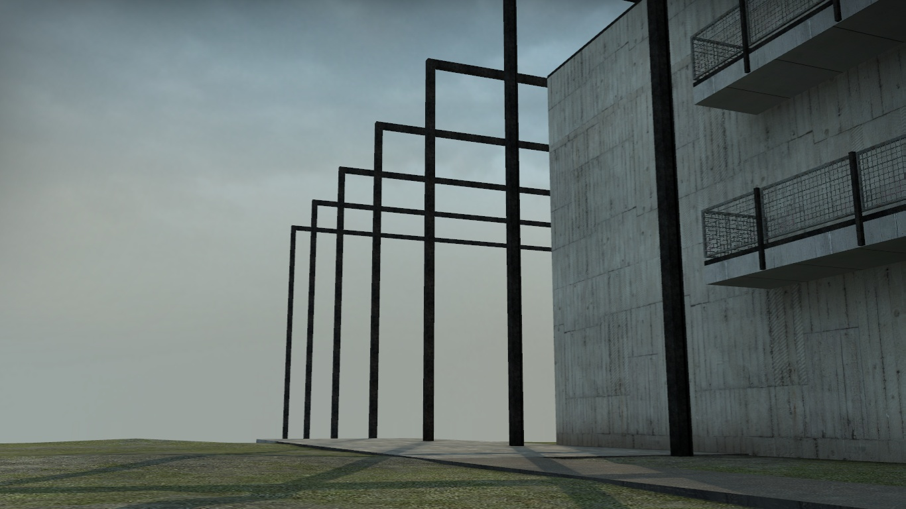

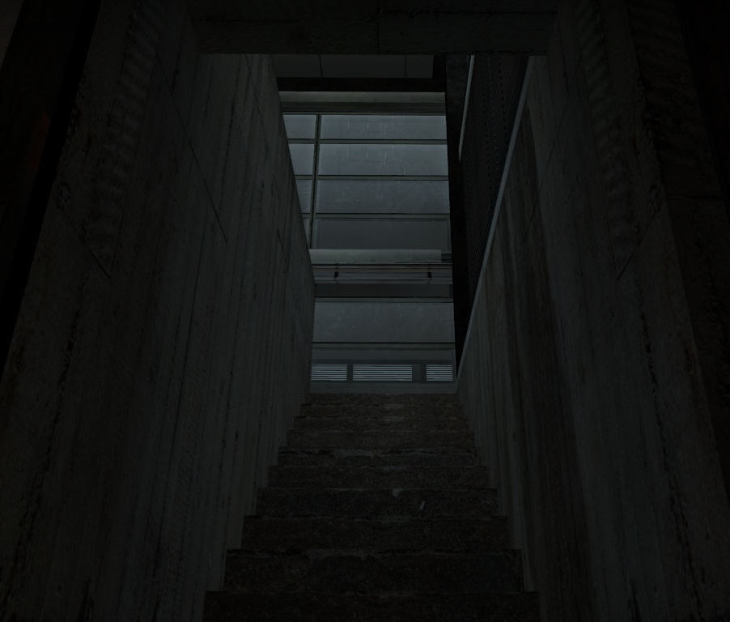

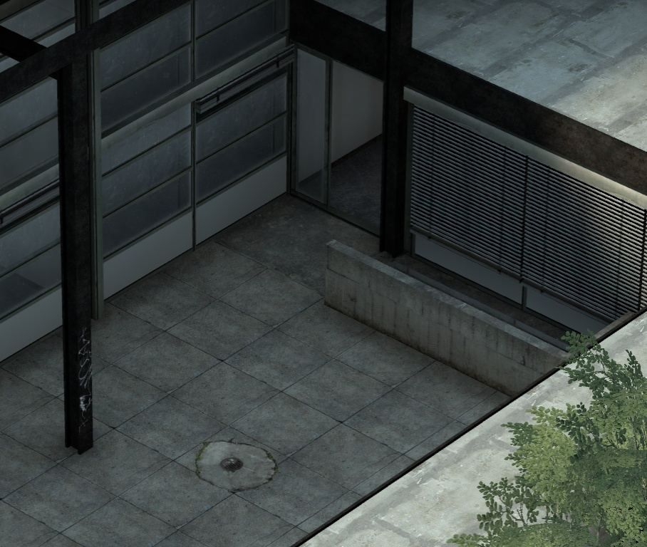

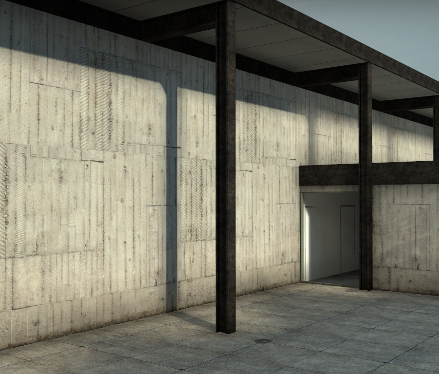

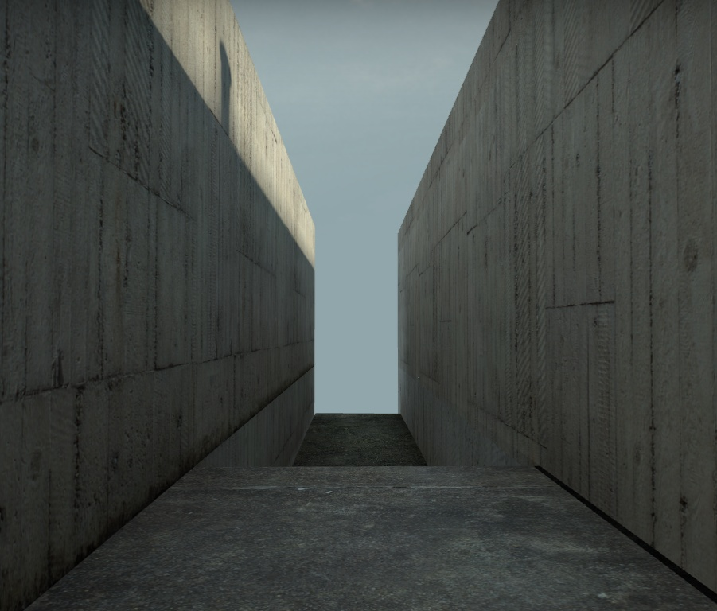

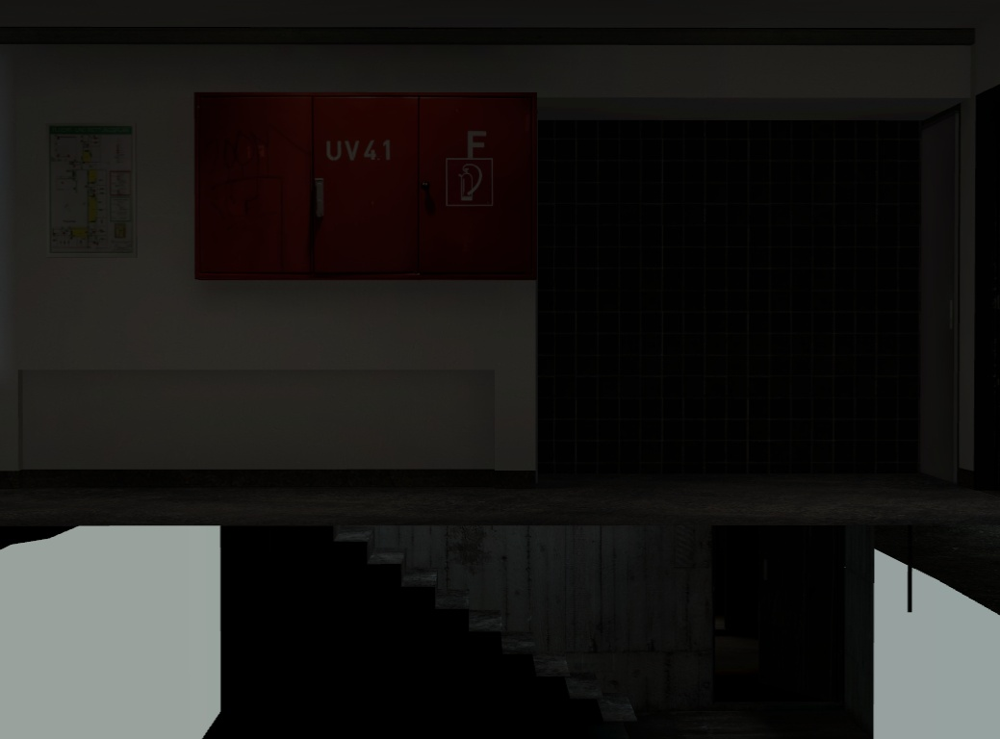

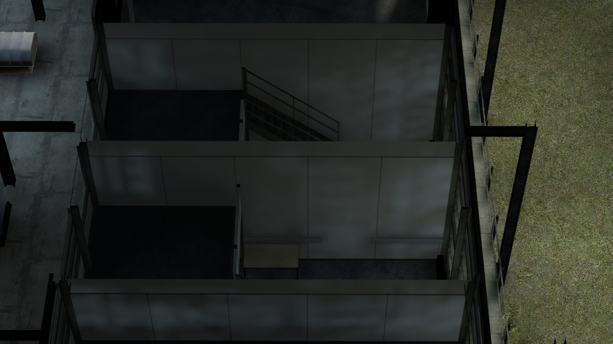

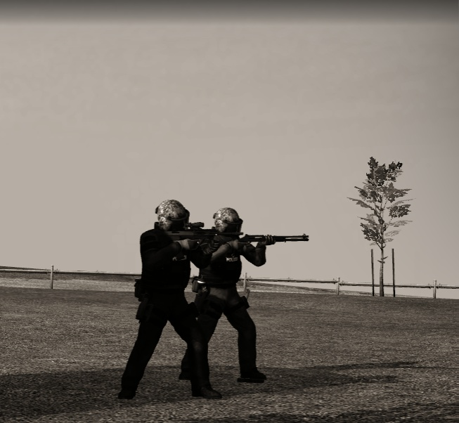

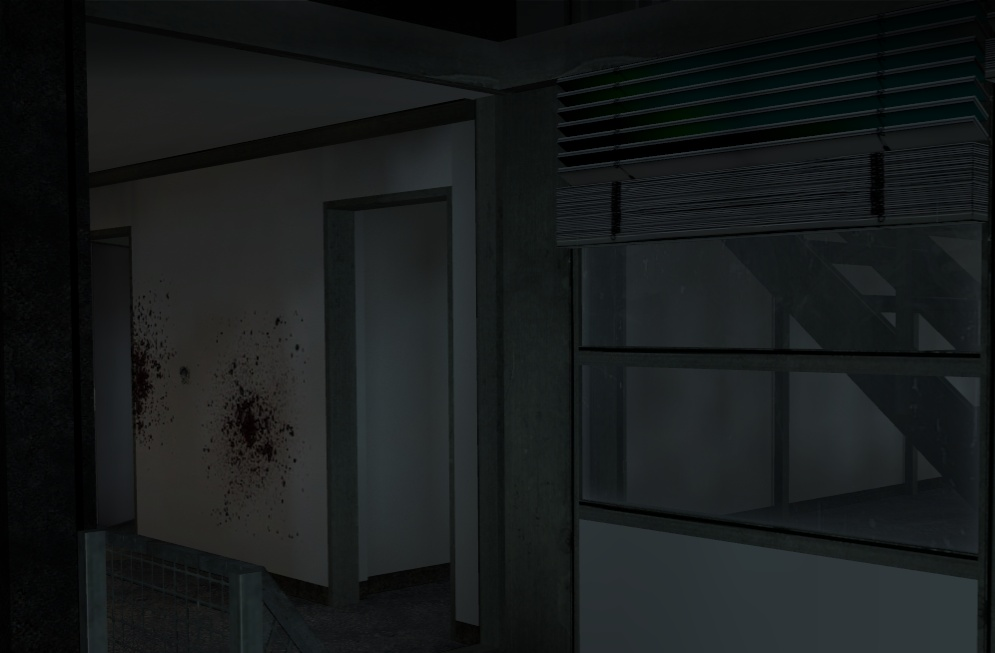

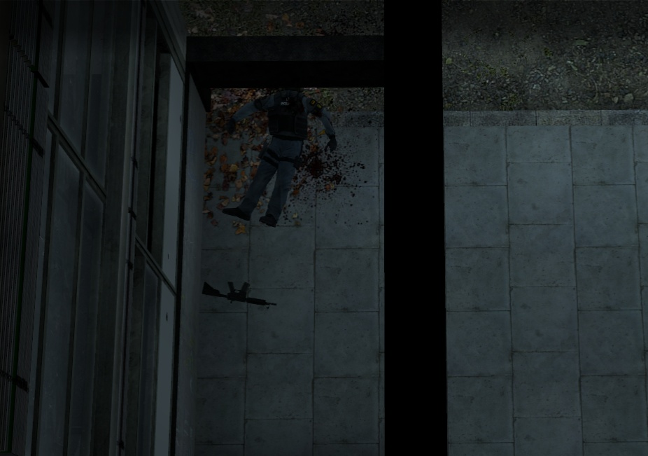

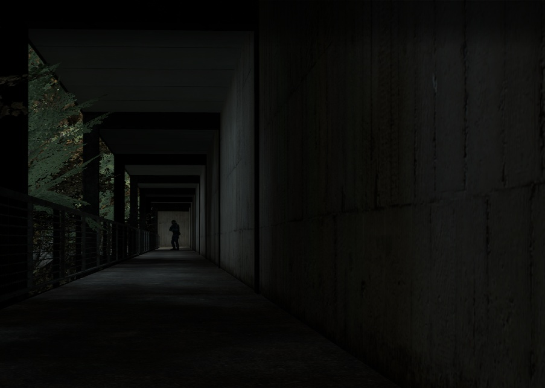

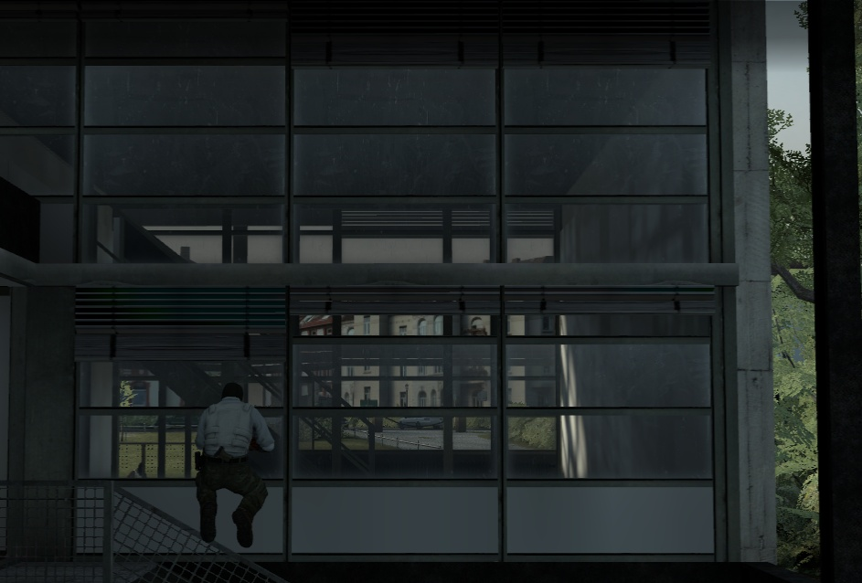

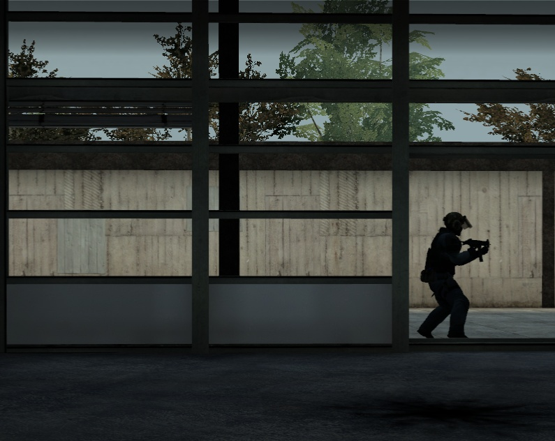

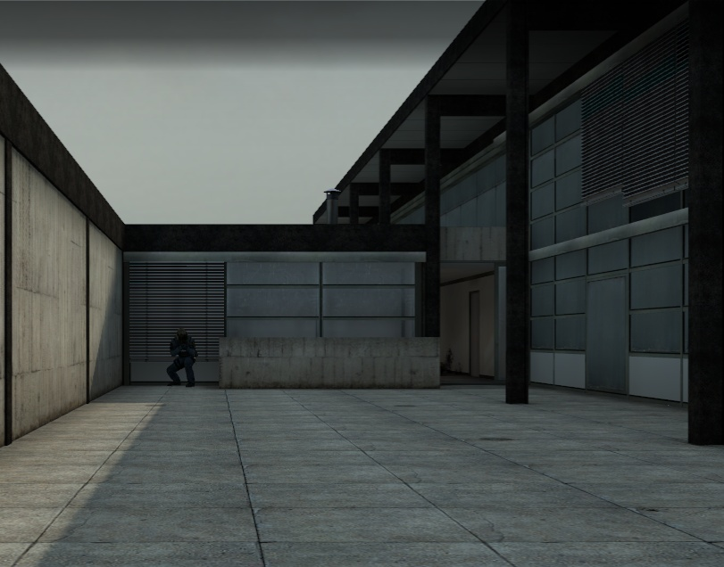
