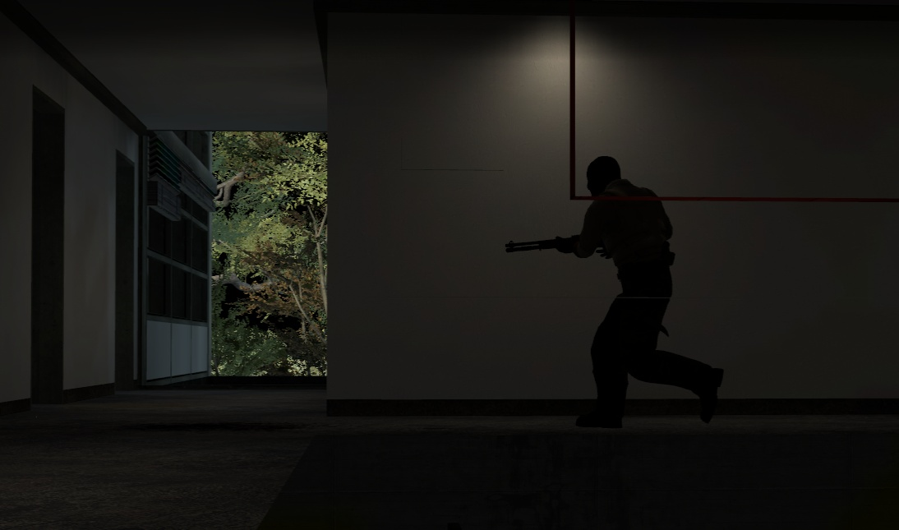

# map de_kunsthochschule

Date: 2016/07/13

Authors: [Nicole Brauer](https://www.google.com/#safe=off&q=nicole+brauer)

Keywords: installation, performance, generated, artificial intelligence, ai, counterstrike, cs, cs:go, kunsthochschule, kassel, killerspiele, ballerspiele, amok, terrorists, voyeurism, live

---
---

*map de_kunsthochschule* is a generative performance inside the game *Counter Strike: Global Offensive*.

The School of Arts and Design in Kassel (Kunsthochschule Kassel) acts as the uncanny, warped stage.

---

