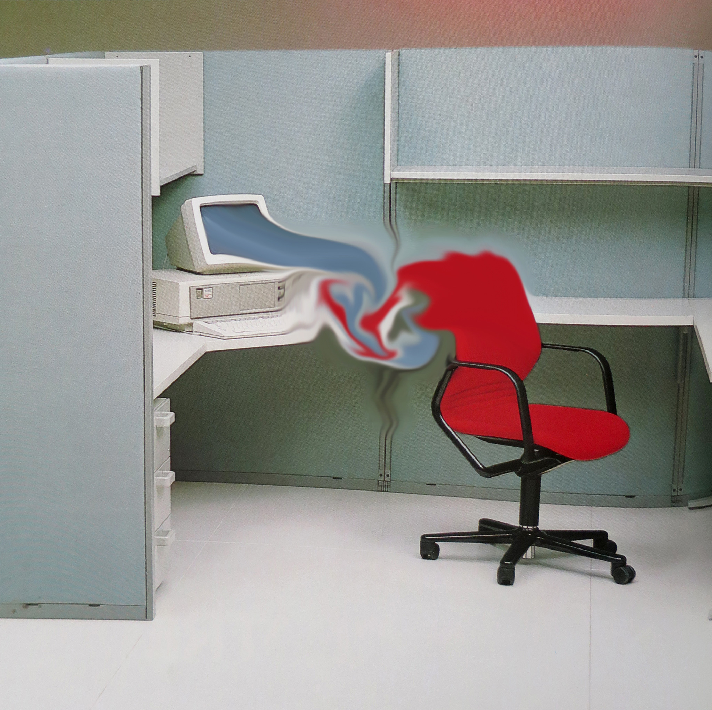

# Feelings On The Net

Date: 2016/11/15
Type: Performance, Workshop
Authors: [Lauren Huret](http://laurenhuret.com/)

---
---

Lauren Huret is a visual artist and reseacher based in Geneva, Switzerland. Lauren explores contemporary narratives that often seem like science fiction (hard science, high frequency trading, artificial intelligence, global corporations, neuroscience marketing and so on). She mainly transmits her rants and critical phantasms about these complex domains via performance and video.

---

## Workshop

- 22.06.16 // Day 1 // 11-17h
- 23.06.16 // Day 2 // 11-17h

The workshop will be an individual and group experiment about our feelings/attitude/behaviors/opinions/beliefs toward the internet (mostly toward social media & weak artificial intelligence). We’ll first try to analyse our emotions with different methods ; then we’ll try to produce something from these results.

### Enrolment

If you would like to attend please send a short motivation letter (4 sentences maximum) on why you are interested - email: [kontakt@joernroeder.de](mailto:kontakt@joernroeder.de?subject=Workshop: Feelings On The Net). Hand this in before 14 November 2016. Participants must attend the full 2 day programme! 

---

## More To Read

- Lauren’s online book about Artificial Intelligence (in english):  
[http://www.kunsthauslangenthal.ch/tl_files/medien/kh_lauren_huret_lulu_download.pdf](http://www.kunsthauslangenthal.ch/tl_files/medien/kh_lauren_huret_lulu_download.pdf)
- Explore the Erik Davis’ website if you don’t already know it:  
[https://techgnosis.com/](https://techgnosis.com/)
- Listen to Katherine Hayles: [http://culturemachinepodcasts.podbean.com/e/technogenesis-and-media-specific-analysis-n-katherine-hayles/](http://culturemachinepodcasts.podbean.com/e/technogenesis-and-media-specific-analysis-n-katherine-hayles/)