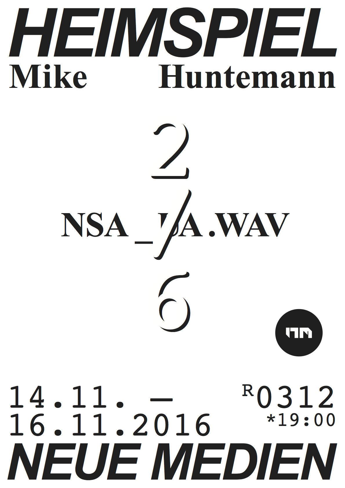

Date: 2016/11/14
Authors: [Mike Huntemann](http://mikehuntemann.de/), [Isabel Paehr](http://www.isabelpaehr.com), [Jörn Röder](http://joernroeder.de)
Keywords: nsa, untersuchungsausschuss, privacy, arena, heimspiel, video, installation

---
---

# NSA_UA
<iframe src="https://player.vimeo.com/video/219681007?title=0&byline=0&portrait=0" width="500" height="281" frameborder="0" webkitallowfullscreen mozallowfullscreen allowfullscreen></iframe>

Die Video-Installation _NSA_UA_ basiert auf dem zeitlichen Rhythmus des NSA-Untersuchungsausschusses, welcher durch tieftonige Synthesizer-Sounds und Audio-Ausschnitte öffentlicher Aussagen zu inhaltlichen Wendepunkten ergänzt werden. Auf der Bildebene leuchten zeitlich passende Zusammenfassungen, bevor diese verblassen und mit den vorangegangenen Textstücken verschmelzen.

Video-Installation, 14 min, HD, Stereo, Loop

---

Heimspiel. Bi-weekly public solo exhibitions at New Media Kassel.

Every second week a student of New Media exhibits works in our 15 sqm
dedicated gallery space. The 'Home Game' series helps the students to
test run ideas and to gain experience in planning and setting up works.
In a public critique process the class and visitors then discuss the show.
