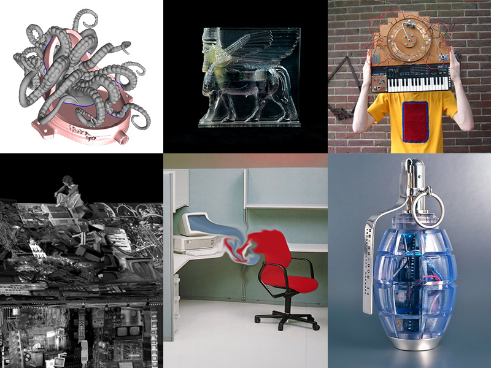

# International Artist Talk / Workshop Series

Date: 2016/11/01
Type: Lecture, Workshop, Performance

---
---

2016 - NM presents a talk and workshop series that explores Media Archeology as an artistic approach and Critical Material Practices.

---

## [Morehshin Allahyari](http://www.morehshin.com/) `[Iran/USA]` & [Daniel Rourke](http://machinemachine.net/) `[UK]`
### #Additivism // An Encounter with The Fluid Outside

- 11-12.05 / 11:00-16:30 / Workshop: 3D Fabrication as Critical Framework  
- 11.05 / 18:00-20:00 / Talk  / Papiercafé

__Keywords:__  
3D printing, 3D Additivist Manifesto, Donna Harraway, technocapitalism, crude oil, Accelerationist, Xenofeminist, environmental ethics, objects in movements for social and political change 

[More Infos](/additivism)

---

## [Lauren Moffatt](http://www.fact.co.uk/people/artists/lauren-moffatt.aspx) `[Australia/Germany]`
### Oculist Reason // Experiencing Archives in Virtual Environments

- 9-10.6 / 11:00-16:00 / Workshop: Photogrammetry for Virtual Reality / R311
- 9.6 / 18:00-20:00 / Talk /  Papiercafé

__Keywords:__  
storytelling in 3D environments, video, game environments, moving image, history of Cinema, immersive technologies

[More Infos](/the-oculist-reason)

---

## [Gijs Gieskes](http://gieskes.nl/) `[Netherlands]`

### Dumpster Drum Machine

- 22-23.06 / 11:00-17:00 / Workshop: Dumpster Drum Machine
- 23.06 / 21:00-23:00 / NM GrillParty + Demos/Performances / R311

__Keywords:__  
Media Archeology, DIY electronics, Sound Art, Experimental Music, circuit design

[More Infos](/dumpster-drum-machine)

---

## [Lauren Huret](http://laurenhuret.com/) `[Switzerland]`

### Feelings On The Net

- 15.11.16 // Workshop Day 1 //10:30-16:30
- 16.11.16 // Workshop Day 2 //10:30-13:00
- 15.11.16 / 18:00-20:00 / Talk / Papiercafé

[More Infos][/feelings-on-the-net]

