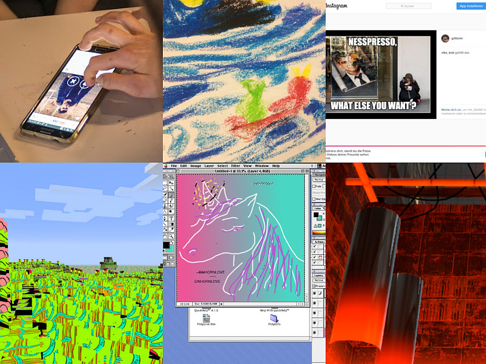

# Basisklasse 2016 / Foundation Class Workshops 2016

Date: 2016/12/12
Type: Lecture, Workshop

---
---

### Essen die Stimme?! Sound Workshop // Echo

__Keywords:__  
collage, cutting, sound, contrast, disconnect

[Examples](/essen-die-stimme)

---

### Minecraft Texturegrammetry // Aram & Stefan

__Keywords:__  
minecraft, texturepack, processing, random textures, modding

[More info](https://www.flickr.com/photos/bartholl/albums/72157677248269272/with/31976698360/)

---

### Memeworkshop // Jonas & Hannah

__Keywords:__  
meme, dank, much workshop, very new media

[More info](https://www.instagram.com/grillznm/)

---

### Games Tourism ~ tool-assisted meandering // Nicole & Hannes

__Keywords:__  
game tourism, photography, wandering, exploration, hacking, speedruns

[More info](http://vectorpoem.com/tourism)

---

### Tinder Me Plenty // Mario

__Keywords:__  
tinder, online dating, fake persona, graphic editing, photoshop, competition

---

### Wettercam Selfie // Jonas & Hannah

__Keywords:__  
excursion, webcam, live, public spaces, surveilance, selfies

[More info](http://www.wetter.com/hd-live-webcams/deutschland/kassel-wilhelmshoehe-best-western-hotel-kurfuerst-wilhelm-i/535f4e256dfe0/)

---

### Vintage Graphics Software // Cäsper

__Keywords:__  
virtual machines, abandonware, photoshop, mac, paint, mario paint, retro os, drawing

---

### Easy Painting // Zhifeng

__Keywords:__  
painting with code, processing, generative art

---

### Map the hidden Infrastructure // Jörn & Joel

__Keywords:__  
infrastructure, wifi, the cloud, invisible architecture, always online

---

### Official Sunset Film Lounge // Nicole & Hannes

__Keywords:__  
film program, cinema, hard scifi, speculative fiction, human-machine interaction

[Solyaris (1972)](https://en.wikipedia.org/wiki/Solaris_(1972_film))

[Her (2013)](https://en.wikipedia.org/wiki/Her_(film))

