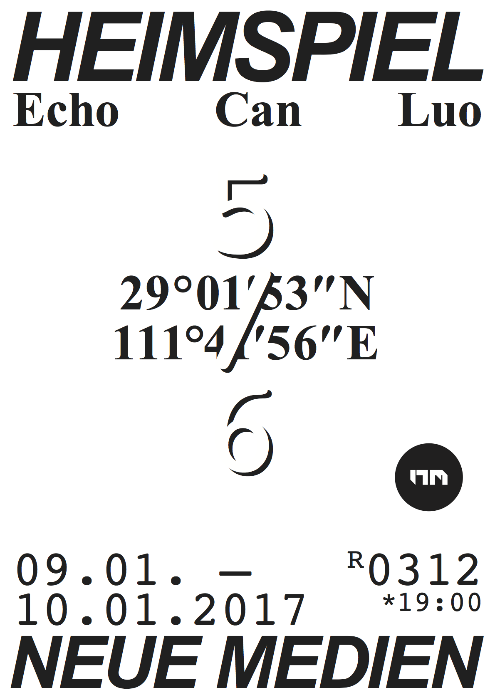

# 29°01′53″N 111°41′56″E

Date: 2016/11/00
Authors: [Echo Can Luo](https://vimeo.com/user8116607)
Keywords:

---
---

<iframe src="https://player.vimeo.com/video/223621714?title=0&byline=0&portrait=0" width="640" height="360" frameborder="0" webkitallowfullscreen mozallowfullscreen allowfullscreen></iframe>

Dieser Film ist in einer kleinen Stadt in Südchina Changde City entstanden. Der Film ist in drei Teile gegliedert. Die Stadt war wegen der Schlacht des Zweiten Weltkriegs bekannt, sie ist auch meine Heimatstadt. Ich habe einen Japaner dokumenti- ert und einige dort lebender Leute ge lmt. Der Japener woh- net jetzt in die Stadt, um den Opfern des zweiten Weltkrieg zu helfen.

---

Heimspiel. Bi-weekly public solo exhibitions at New Media Kassel.

Every second week a student of New Media exhibits works in our 15 sqm
dedicated gallery space. The 'Home Game' series helps the students to
test run ideas and to gain experience in planning and setting up works.
In a public critique process the class and visitors then discuss the show.
