# MAKE IT FIT!

Date: 2017/02/04
Type: Exhibition
Authors: Nicole Brauer, Echo Canluo, Christopher Casper, Hannes Drescher, Lou Hardt, Saskia Kaffenberger, Hannah Kretzschmar, Jonas Leichsenring, Jasper Meiners, Isabel Paehr, Jörn Röder, EIEE, Fritz Laszlo Weber, Zhifeng Zhang, Aram Bartholl

---
---

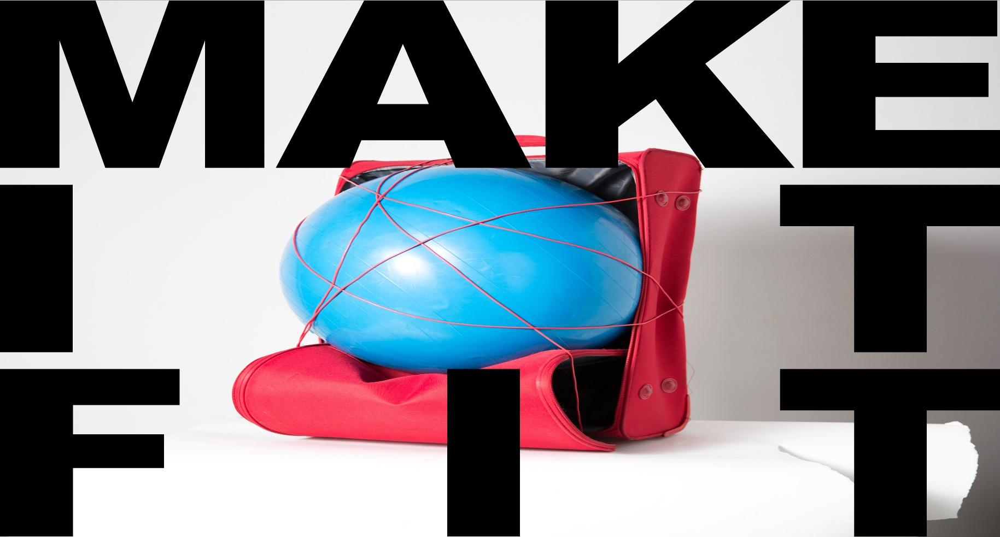

## Hyper mobile art in travel baggage sizes

**4. - 5. February 2017**  
**panke.gallery**

Kunsthochschule Kassel – The New Media class is proud to present new works at panke.gallery, Berlin. The pieces range from installation, performance, screen-based and interactive works to video and film. 'Make it fit' refers to the restrictive cabin baggage rules of budget airlines, including their painfully meticulous control mechanisms. A lifestyle-conscious, hyper-mobile generation rattling trolleys along pavements has become the hallmark of gentrified neighborhoods in travel-hyped European capitals.

[MORE at MAKE-IT-FIT.NET](http://www.make-it-fit.net/)

[@makeitfit_nm on Instagram](https://www.instagram.com/makeitfit_nm/)

[Flickr Set](https://www.flickr.com/photos/bartholl/sets/72157678572549491)

---

<iframe width="560" height="315" src="https://www.youtube.com/embed/wuFQE304Mrg" frameborder="0" allowfullscreen></iframe>

---

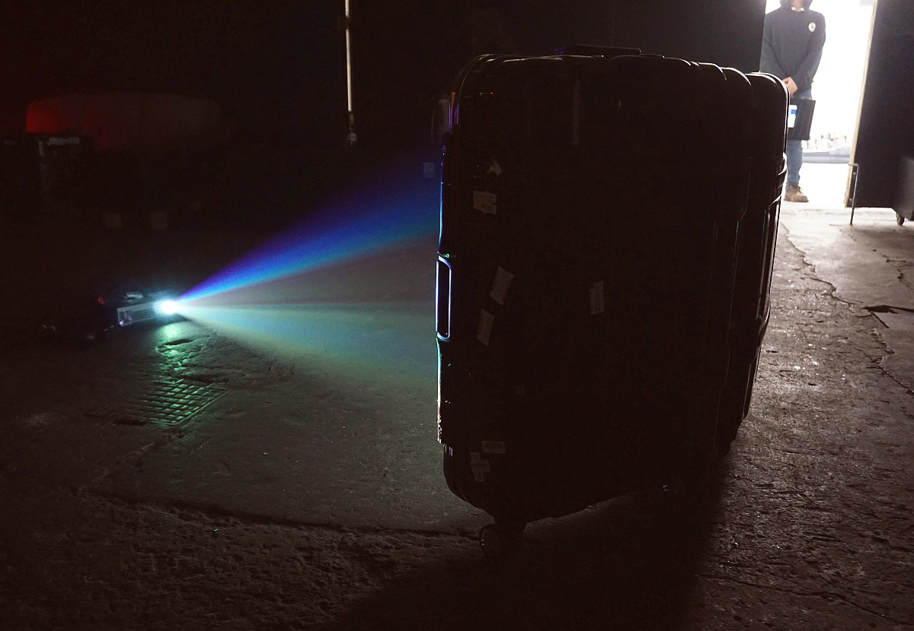

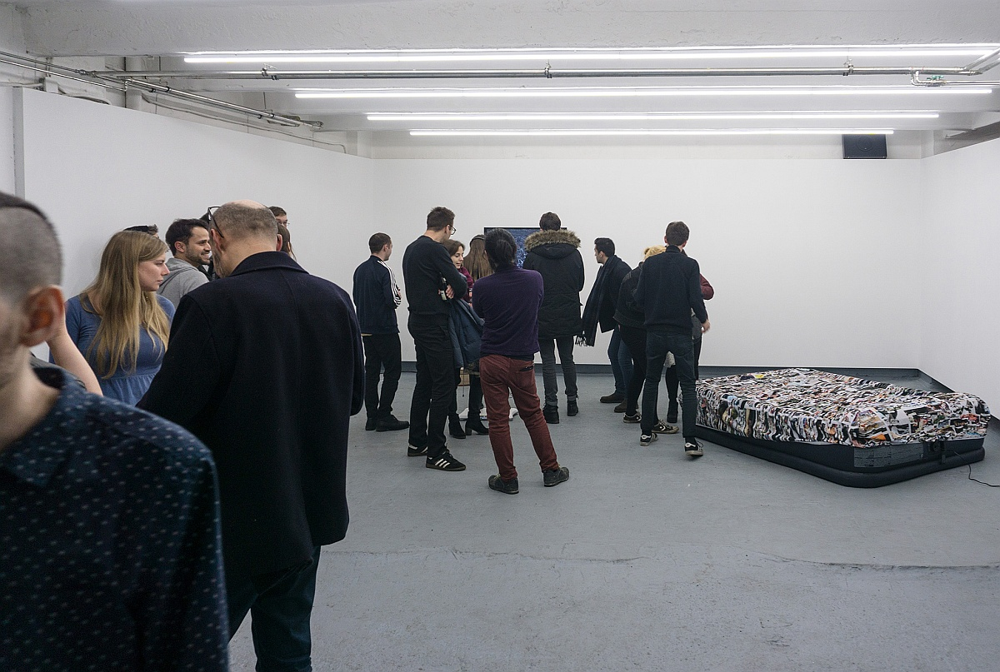

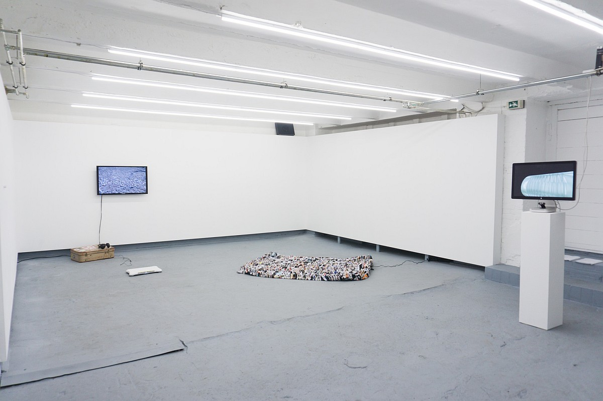

---

## All is surface

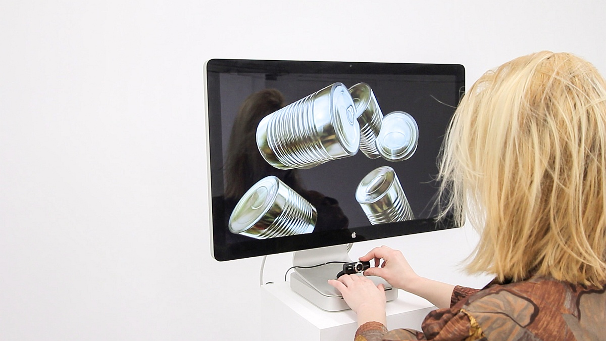

### software, your browser, 2017
**Jasper Meiners, Isabel Paehr**

Surface be common sense, desire be object, belonging be reflection, bodies be melted.
Experience yourself as translucent: Your materiality is of skin and blood. By touching the lense, the imagery
turns red.

---

## HomeSweetHome

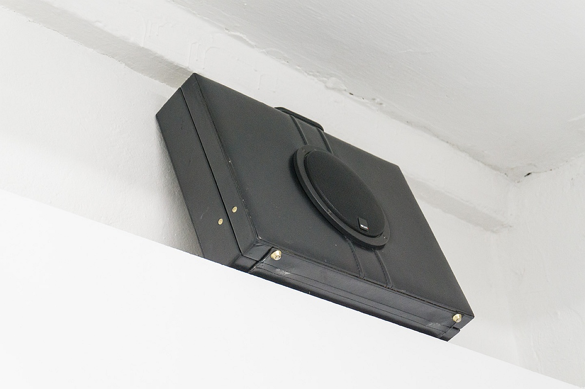

### Smart-Device Wifi Perfomance, 2017
**Jörn Röder, Isabel Paehr, Lennert Raesch, IEII**

How long can we leave our home without feeling homesick, how many hours until we try to reconnect?
Our smart devices are not as stable as we are, with wifi turned on they long to connect to what they know, frightfully seeking for their home nets, nevertheless exposing their generic voices to everyone who dares to listen.
The suitcase homeSweetHome gives voice to the numerous smart devices screaming network names.

---

## Google Comfort

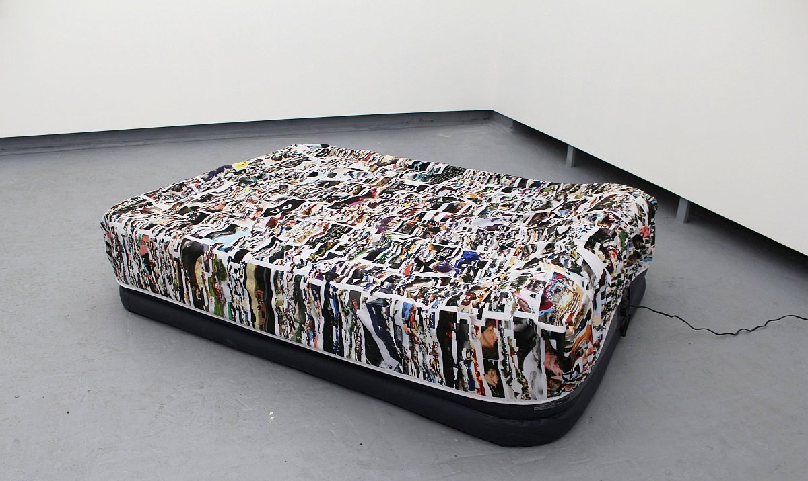

### air bed, printed fitted sheet, 2017
**Hannah Kretzschmar, Jonas Leichsenring**

The air mattress shows all pictures from google search \#makeitfit compressed upon one fitted sheet.
Using the content aware-scaling tool in photoshop which cannot handle the huge amount of data, images are destroyed, shred to pixels or only partly visible.
It reflects the way we are ourselves embedded in constantly receiving and sharing information, and thus, participating in the lives of others.
Dealing with the rapidity of mass information in a modern hyper-mobile art show the mattress invites you to
sit or lie down and take your time thinking and relaxing.

---

## A Human test machine

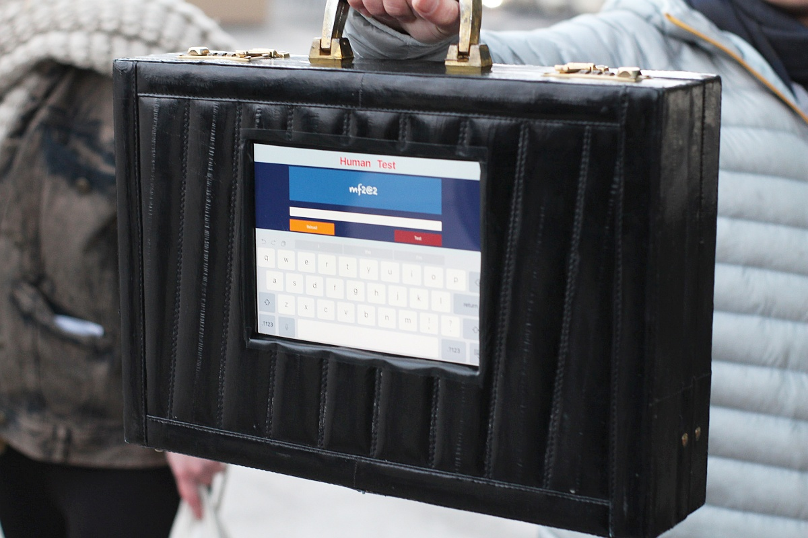

### 2017
**Zhifeng Zhang**

Everyday should we as human over million times with CAPTCHA tell to our computer that “YES I AM A HUMAN”. But why we just do it and think it’s nothing at all. So I build a Human test machine and ask someone to make this test just like usually with computer.

---

## The virtual self

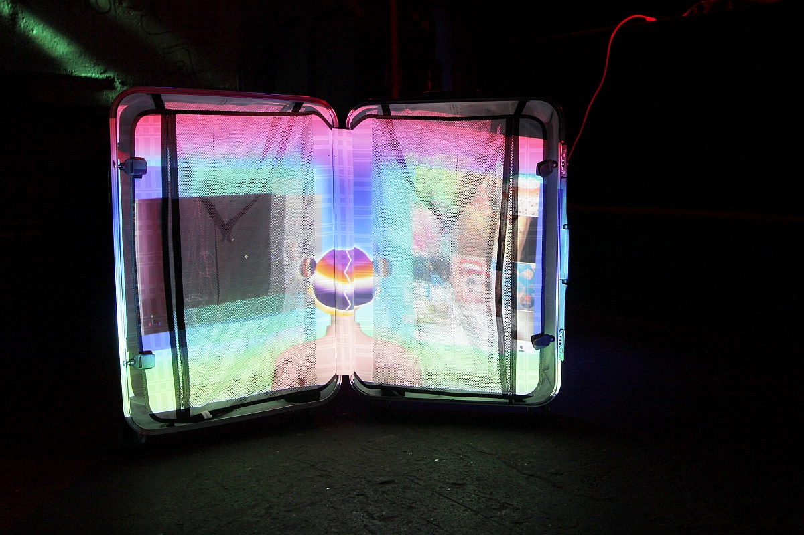

### mixed media, software, 2017
**Echo Canluo**

The present video displays how to simulate and create an unrealistic portrayal of oneself through different softwares on computer. The instant the body vanishes alongside the "self" controlled by machine and technology, another self is created meanwhile. This is to discuss about how to define the boundaries of a living, realistic "me" in such an ever changing digital age.

---

## make-it-fit-net

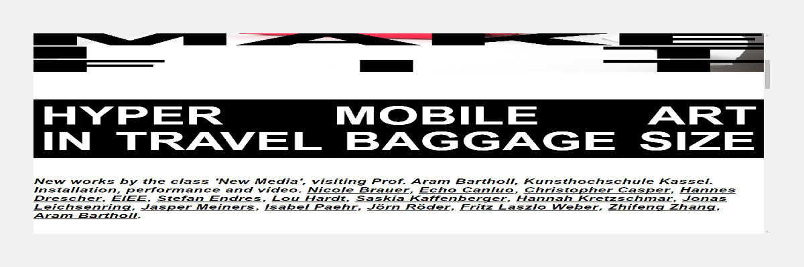

### website, 2017
**Stefan Endres**

make-it-fit.net expands today’s web design’s very present approaches ‚Responsive web design‘ and ‚Mobile first‘‚ to fit to your individual setting of device, screen and software. Headings are justified, font size and layout scales continuously, while imagery’s proportions are ignored and adapted to the dimensions of your viewport.
The post-exhibition website will provide compressed documentations of each work via downloadable zip-files.

---

## YATOTW.exe

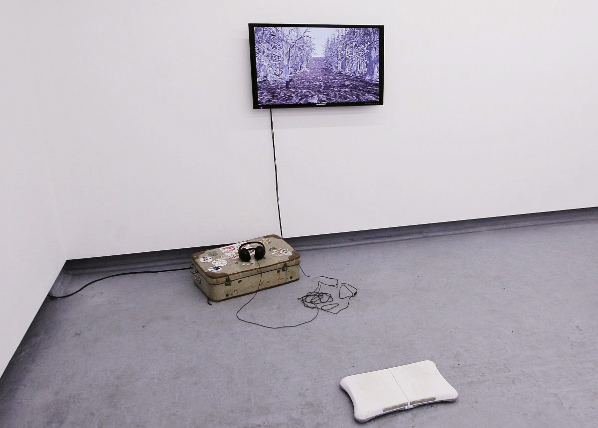

### bits on memory, wii balance board, 2017 
**Hannes Drescher**

You, on a predefined path:  
"That green,  
brown,  
gray,  
dank"
 
---

## Mimikri

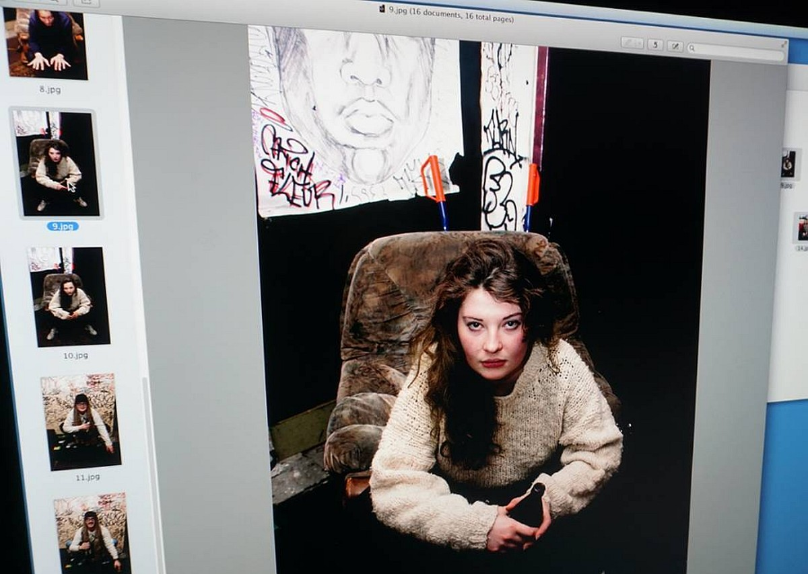

### photographic performance, 2017
**by Lou Hardt**

Make it fit-a portrait of fashion and appearance.
I will take one photo of you and one of myself with your clothes on.
Both pictures set together; what effect will they have on an uninvolved/intermediary spectator?
How will you perceive your appearance when it's worn by another person? In which ways is it going to influence their opinion on themselves and you, according to the change of appearance?
To what extend it is possible to appropriate style?
Slipping into the clothes of strangers; an experience of how outfits change the perception of yourself, the other, and how you’re perceived by outsiders.

---

## YOU WHERE HERE

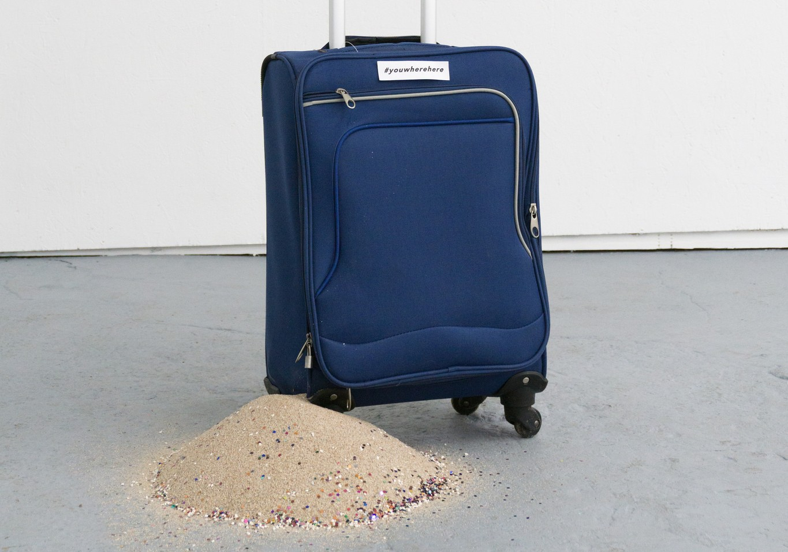

### sand, glitter, suitcase, 2017
**Saskia Kaffenberger**

\#youwherehere  
-analog tracking  
a suitcase filled with sand and glitter.  
the sand is running like time, with shimmering elements of your experience,  
the suitcase a broken hourglass

In the stone age they left their hand prints on cave walls - what do you leave today?  
what do you want to leave?  
who follows your traces?  
(fear not you are watched.)

---

## De-Standardization of the Life Course

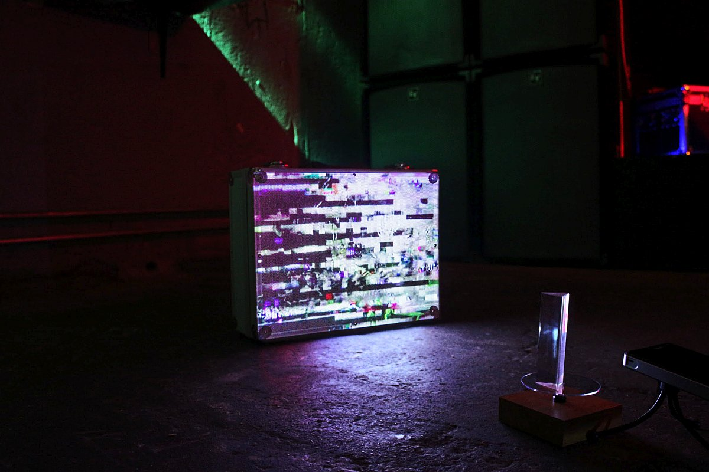

### suitcase, beamer, prism, 2017
**Christopher Casper**

The change to the postindustrial way of life is determined by the de-standardization of the life course. On one hand, these non-linear biographies offer people the chance to live up to their full potential by allowing them to make their own life choices that are more independent from formerly predetermined social roles and structures. On the other hand, this existence is characterized by the many uncertainties of ever shorter and fluctuating stages of life. People have to constantly readjust and reorient themselves and be able to form new social relationships. This is a challenging task to many.

---

## Never worry again

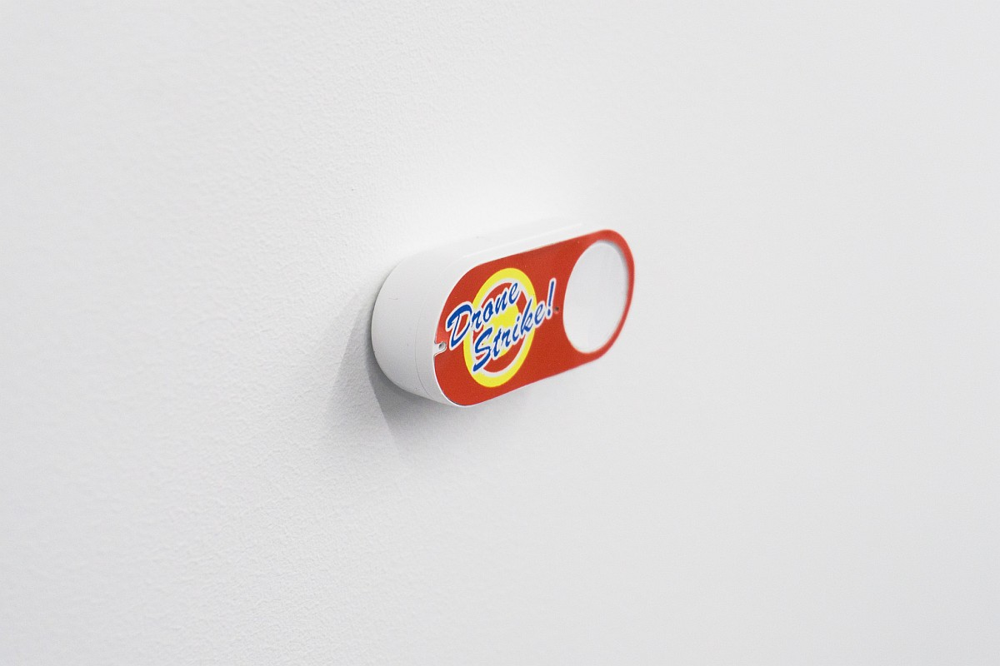

### Amazon Dash button, 2017
**Aram Bartholl**

Amazon Dash is a consumer goods ordering service which uses a proprietary device for ordering goods over the Internet. More at Wikipedia

---

## Video Screening

**Make it fit - Trailer** by Nicole Brauer

**Insert your nipple here** by Malin Kuht

**InternetRestroom Trailer 1** by Isabel Paehr, Jasper Meiners

**LAST CHANCE JUNCTION** by Holger Jenss

**Passt doch** by Karo Twiddy

**making waves unmastered** by Fritz Laszlo Weber

**InternetRestroom Trailer 2** by Isabel Paehr, Jasper Meiners

**29°01′53″N 111°41′56″E** by Echo Canluo