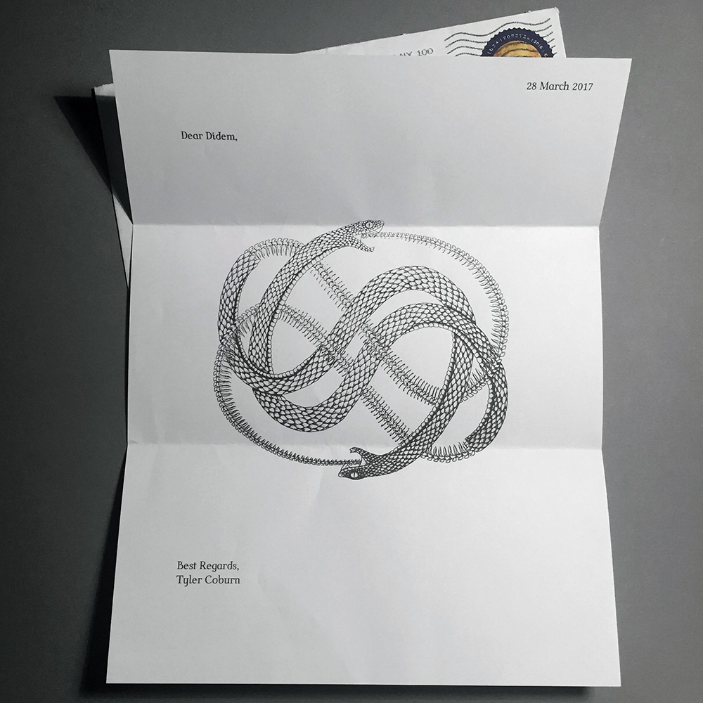

Date: 2017/01/19
Authors: [Didem Sandikci](http://didemsandikci.com)
Keywords: post, letter, space, internet, relationship, artists

---
---

# Dear Space

_Dear Space_ aims to examine the internet as a space from the perspective of the artists and tries to question their present relationship with the internet through almost perfectly opposite companion: letters. Artists are received the question with a handwritten letter and asked to answer it in the same way. These are the answers of the participated artists.

[dearspace.online](http://dearspace.online/)

---

Heimspiel. Bi-weekly public solo exhibitions at New Media Kassel.

Every second week a student of New Media exhibits works in our 15 sqm
dedicated gallery space. The 'Home Game' series helps the students to
test run ideas and to gain experience in planning and setting up works.
In a public critique process the class and visitors then discuss the show.
