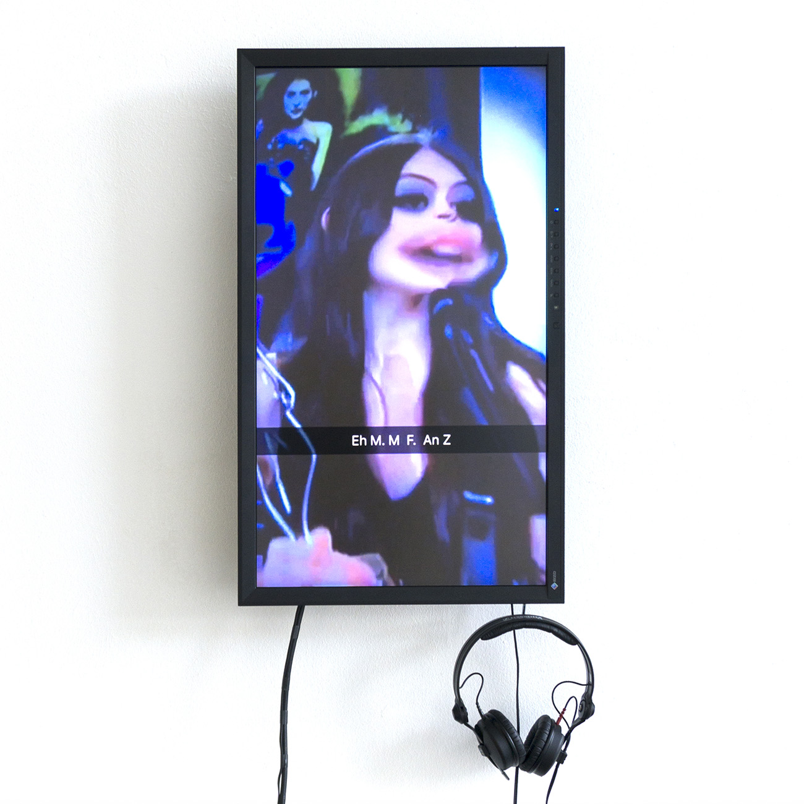
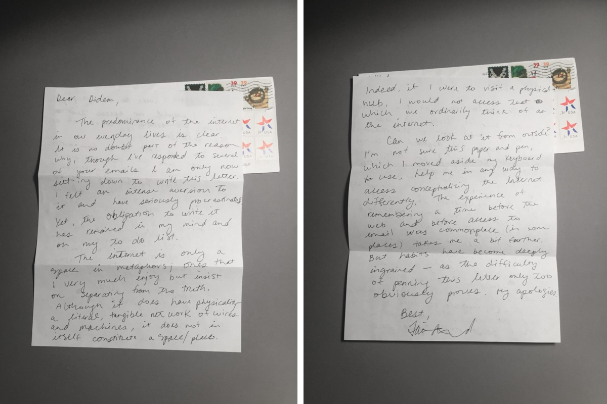

# MAKE IT FIT!

Date: 2017/07/13
Type: Exhibition
Authors: Leonard Bahro, Echo Canluo, Christopher Casper, Hannes Drescher, Stefan Endres, Mike Huntemann, Saskia Kaffenberger, Jonas Leichsenring, Jasper Meiners, Naima Omari, Isabel Paehr, Didem Sandikci, Mario Strahl, Nicole Voec, Zhifeng Zhang

---
---

## y tho

**Klasse Neue Medien, Prof. Aram Bartholl**  
**Kunsthochschule Kassel, Rundgang 2017** 

**13.7. – 16.7.2017**

Die Klasse ‚Neue Medien‘ zeigt neue Arbeiten aus dem Jahr 2016/17. In einem weitem Spektrum an Fragestellungen untersuchen die Studierenden die Einflüsse von digitaler Kultur und Internetphänomenen auf die Gesellschaft. Mit Websites, Video, 3D, Games bis hin zu Installation und skulpturalen Arbeiten verhandeln die einzelnen Positionen der Klasse aktuelle Themen der post-digitalen Generation. Der Ausstellungstitel y tho ist dem gleichnamigen Internet-Meme entlehnt und thematisiert die typische Kommentarkultur im Netz. 

*A massive lacking of understanding or comprehension of what you are witnessing. To be confused beyond the realities of the real world. A true blown lightbulb moment.  - (Urban Dictionary)*

Folgende Studierende zeigen Arbeiten:

**Leonard Bahro, Echo Canluo, Christopher Casper, Hannes Drescher, Stefan Endres, Mike Huntemann, Saskia Kaffenberger, Jonas Leichsenring, Jasper Meiners, Naima Omari, Isabel Paehr, Didem Sandikci, Mario Strahl, Nicole Voec, Zhifeng Zhang** 

---

**Stäbchen-Fisch**, Leonard Bahro, 2017, Elektromechanische Installation, Aquarium auf Sockel

Das Prinzip der menschlichen Entfremdung von der lebendigen Form der Nahrungsgrundlagen zog parallel zur Industrialisierung in das Alltagsleben ein und lässt nicht nur vergessen wie vor allem die Tiere aussahen, welche in Industrienahrung verarbeitet wurden, sondern erregen bisweilen sogar Ekel in uns bei dem Anblick von Tierkadavern oder dem Versuch selbst Tiere für den Verzehr vor- und zuzubereiten.
Hier wurde das verarbeitete Produkt wieder in seine arttypische Bewegung versetzt.

---

**Reiselied**, Christopher Casper, 2017, 3D Rendering, Exhibtion, Full HD, 
      
Neben der physischen Fortbewegung, beschreibt „Reise“ auch den Wandlungsprozess des Lebens eines Menschen. Demnach ist die Reise nicht als Entfernungsüberbrückung, sondern als Bild für das Leben eines Menschen zu verstehen. Reisen, um sich selbst zu erfahren - denn die Ursprüngliche Bedeutung des Wortes (rīsan) bedeutet soviel wie „sich erheben“ und „aufstehen“ (vgl. engl. to rise). Der Wandel hin zur post-industriellen Lebensweise der nicht-linearen Lebensläufe, kann durch viele aufeinanderfolgende kurze Lebensabschnitte geprägt sein. Wo wurde der Faden des alltäglichen Lebens unterbrochen und wie findet man heraus, wo man wirklich war?

---

**Oh Alexa, please..tell me more!**, Echo Canluo, 2017, Installation: Amazon Echo Dot, Sofa, Screens, Video 

Alexa is an intelligent personal assistant developed by Amazon, made popular by the Amazon Echo and the Amazon Echo Dot devices developed by Amazon Lab126. In this video installation / performance, Alexa is spending time with her friends. They chat about a series of interesting people and other questions in addition to the past and the future.

---

**Der wunderbare Garten der Medina Newton**, Hannes Drescher, 2017

Die im Deutschen verbreitete Bezeichnung Windhund bedeutet möglicherweise ursprünglich wendischer (slawischer) Hund, was dann darauf hinwiese, dass Windhunde im deutschen Sprachraum vor allem aus dem slawischen Raum bekannt gewesen seien. Dann wäre der Bezug zum deutschen Wort Wind (Luftzug) ein klassischer Fall von Volksetymologie.

---

**SuperFameRelaxation**, Stefan Endres, 2017, Website

Beifall ist der Ausdruck der Billigung oder des Gefallens einer Darbietung. In Europa und den USA wird Beifall meist durch Klatschen mit den Händen (auch: Applaus, von lat. applaudere ,etwas an etwas schlagen‘) kundgetan. Die Website SuperFameRelaxation bietet eine ‚Highest Level User Experience‘.

---

**GNTM_S12E16_Das_spektakuläre_Finale.mp4**, Mike Huntemann, 2017, Video-Snapchat Performance

Am Abend des 25. Mai 2017 schauten 2,67 Millionen Zuschauer “das spektakuläre Finale” der 12. Staffel von Germany’s Next Topmodel. In einer dreistündigen Video-Performance, bestehend aus insgesamt 36 Kapiteln, wurde das Fernseherlebnis mit den Features der Snapchat App live kommentiert und dokumentiert.

---

**Spiegelnde Oberflächen**, Saskia Kaffenberger, 2017, Foto, 40x60 cm

Ist es möglich hinter die spiegelnden Oberflächen zu schauen? Was sähe man, wenn man die Selfie-Flut als spiegelnde Oberfläche betrachten würde? Was zeigt die explosionsartige Entwicklung der Selbstdarstellungen per Handy-Click und Selfie-Stick? Sollten wir hier genauer hinsehen? Welches Bedürfnis – oder was – bricht sich hier Bahn? Was genau sah Narziss an der Quelle, was fand Alice hinter den Spiegeln? Aus welcher Denkweise resultieren und was bedeuten Vokabeln wie „Selbstoptimierung“,  „Selbstmarketing“ oder „Markenpersönlichkeit“ für jeden von uns?

---

**Boys Don't Cry**, Jonas Leichsenring, 2017, Eis und Stahl, 25cm

Von Generation zu Generation werden heranwachsende Männer erzogen sich mit bestimmten „männlichen“ Attributen zu identifizieren. „Wann ist ein Mann ein Mann?“. Mit welchen Männerbildern wachsen wir auf und wieso
werden diese so selten hinterfragt. Was bedeutet es heutzutage ein Mann zu sein?

---

**Big Labels Small Prices**, Jonas Leichsenring, 2017,  Textil, S 

Ein Lacoste Polo T-shirt kostet 100 Euro. TK Maxx verkauft große Marken für kleine Preise. Das Sonderposten Lacoste-Polo kostet dort 49,99 Euro. Nach dem jemand in der Filiale das Lacoste-Krokodil von der Brust des Hemdes gerissen hat wurde es weiter auf 17 Euro reduziert. Trotz Nachfrage blieb es bei dem Preis. Was ist der Wert eines Kleidungsstückes? Wie bewerten wir Marken in Zeiten von immer billigeren Ramschläden und globalisierter Massenproduktion?

---

**Shiro**, Isabel Paehr & Jasper Meiners, (Sound von Leonard Bahro), 2017, Mobile Game

SHIRO, meaning white, or emptiness, can be a state of mind or principle of design. Discover the origins of Japanese culture by connecting and interacting with simple geometries, materials and sounds as your smartphone becomes a traditional lacquer box full of stories.

---

**Internet Restroom Station**, Isabel Paehr & Jasper Meiners, Sound von Leonard Bahro, 2016, 3D, Website

*The internet restroom* is an interactive online space accessible through the IP: [http://188.166.163.33](http://188.166.163.33).
Users can communicate with each other by switching on and off lights or by using water basins, doors and dryers. If they need a private space to rest, they can enter a toilet cabin and close its door. They thereby block the specific cabin for other users and make their cabin a truely private space in the no longer privacy-friendly *World Wide Web*. A landing page including manifesto, trailers, images and access to *the internet restroom* can be found on [http://internet-restroom.net](http://internet-restroom.net).

---

**J.A.S.S.**, Naima Omari, 2017, Garderobenständer, vier Kleiderbügel, vier Bustiers

J.A.S.S. ist das Ergebnis einer intensiven Auseinandersetzung mit der jeweiligen Bandbreite der Kommunikation in der Online-Welt. Jeder Buchstabe steht für einen Boyfriend aus dem Internet. Wie gehe ich mit Kommunikation um? Welche Voraussetzungen werden benötigt? Was sind sowohl positive als auch negative Konsequenzen dieser Kommunikation? Meine Antworten münden in der Zusammensetzung von Stofflichkeiten. 

---

**Dear Space**, Didem Sandikci, 2017, Website, Exhibition

"Dear Space" [http://dearspace.online/](http://dearspace.online/) aims to examine the internet as a space from the perspective of the artists and tries to question their present relationship with the internet through almost perfectly opposite companion: letters.  Artists are received the question with a handwritten letter and asked to answer it in the same way.  These are the answers of the participated artists.  "Dear Space" is an ongoing online exhibition by Didem Sandıkcı.                     
---

**FakeIt Spinner**, Mario Strahl, 2017, Video

Was sind Fake News? Wie verbreiten sie sich? Wie entstehen sie?
Diese Videoinstallation beschäftigt sich mit dem Thema "Fake News" und zeigt auf, wie schnell sie sich ausbreiten.

---

**The Cosmosexual Merger**, Nicole Voec, 2017, Performance

Live Aktzeichnen Samstag und Sonntag in der "the war on cyber crime" Baaaaaaaaaaaaaaaaaaaaaaaaaaa aaaaaaaaaaaaaaaaaaaaaaaaaaaaaaaaaaaaaaaaaaaaaaaaaaaaaaaaaaaaaaaaaaaaaaaaaaaaaaaaaaaaaaaaaaaaaaaaaaaaaaaaaaaaaaaaaaaaaaaaaaaaaaaaaaaaaaaaaaaaaaaaaaaaaaaaaaaaaaaaaaaaaaaaaaaaaaaaaaaaaaaaaaaaaaaaaaaaaaaaaaaaaaaaaar

---

**BIG BROTHER**, Zhifeng Zhang, 2017, Keramik, Zeitung, Teller, u.a.

Authoritarian personality is a state of mind or attitude characterized by belief in absolute obedience or submission to one's own authority, as well as the administration of that belief through the oppression of one's subordinates. It usually applies to individuals who are known or viewed as having an authoritative, strict, or oppressive personality towards subordinates. +++ BIG BROTHER IS WATCHING YOU. +++