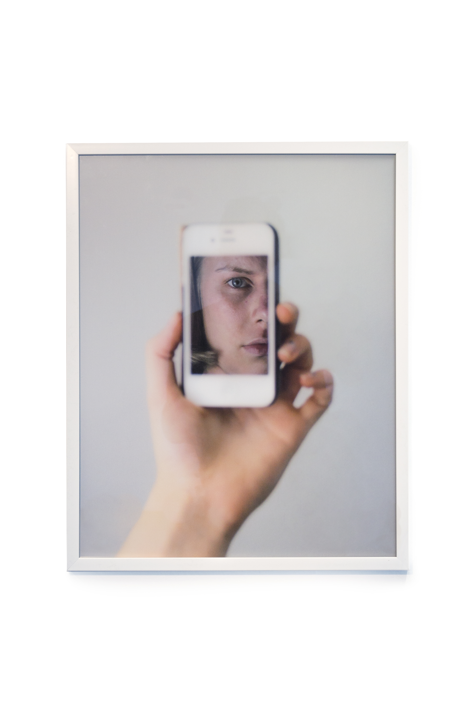

# Spiegelnde Oberflächen

Date: 2017/07/15  
Authors: Saskia Kaffenberger

---
---

2017, Foto, 40x60 cm

Ist es möglich hinter die spiegelnden Oberflächen zu schauen? Was sähe man, wenn man die Selfie-Flut als spiegelnde Oberfläche betrachten würde? Was zeigt die explosionsartige Entwicklung der Selbstdarstellungen per Handy-Click und Selfie-Stick? Sollten wir hier genauer hinsehen? Welches Bedürfnis – oder was – bricht sich hier Bahn? Was genau sah Narziss an der Quelle, was fand Alice hinter den Spiegeln? Aus welcher Denkweise resultieren und was bedeuten Vokabeln wie „Selbstoptimierung“, „Selbstmarketing“ oder „Markenpersönlichkeit“ für jeden von uns?
