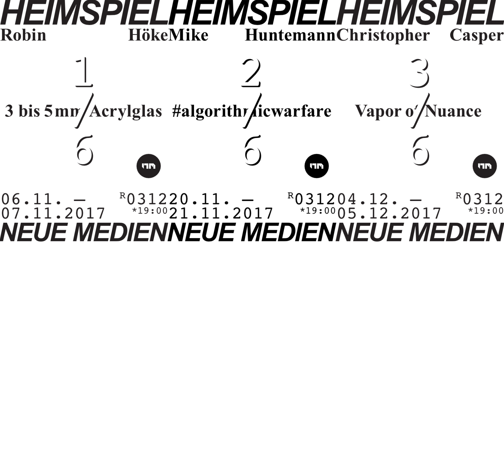
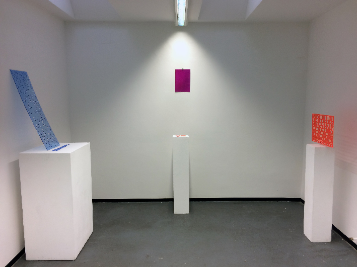
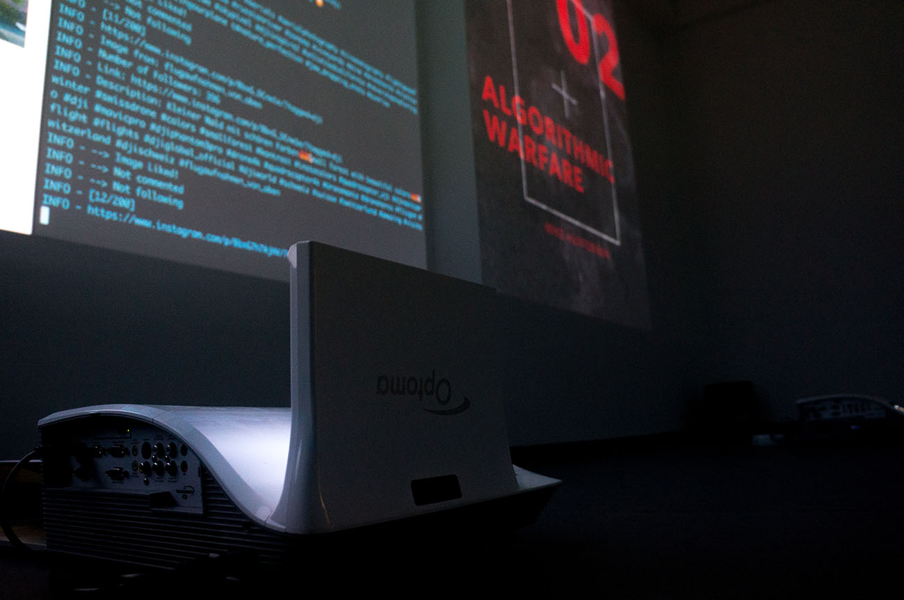

# Heimspiel Series 3

Date: 2017/10/15
Type: Exhibition
Authors: Robin Höke, [Mike Huntemann](http://mikehuntemann.de/), [Christopher Casper](http://www.christopher-casper.de)

---
---

Heimspiel. Bi-weekly public solo exhibitions at New Media Kassel.

Every second week a student of New Media exhibits works in our 15 sqm
dedicated gallery space. The 'Home Game' series helps the students to
test run ideas and to gain experience in planning and setting up works.
In a public critique process the class and visitors then discuss the show.

---

## 3 bis 5mm Acrylglass

**Robin Höke** // 31.10.16

[Read More](/heimspiel-robin-hoeke-3-bis-5mm-acrylglass)

---

## #algorithmicwarfare

**[Mike Huntemann](http://mikehuntemann.de/)** // 20.11.2017

[Read More](/heimspiel-mike-huntemann-algorithmicwarfare)

---

## Vapor of Nuance

**[Christopher Casper](http://www.christopher-casper.de)** // 04.12.2017

<!--[Read More](/heimspiel-christopher-casper-vapor-of-nuance)-->
