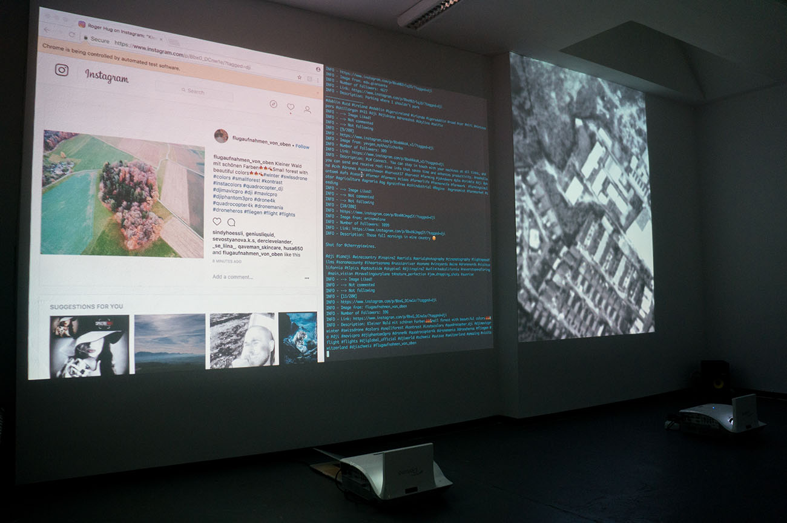
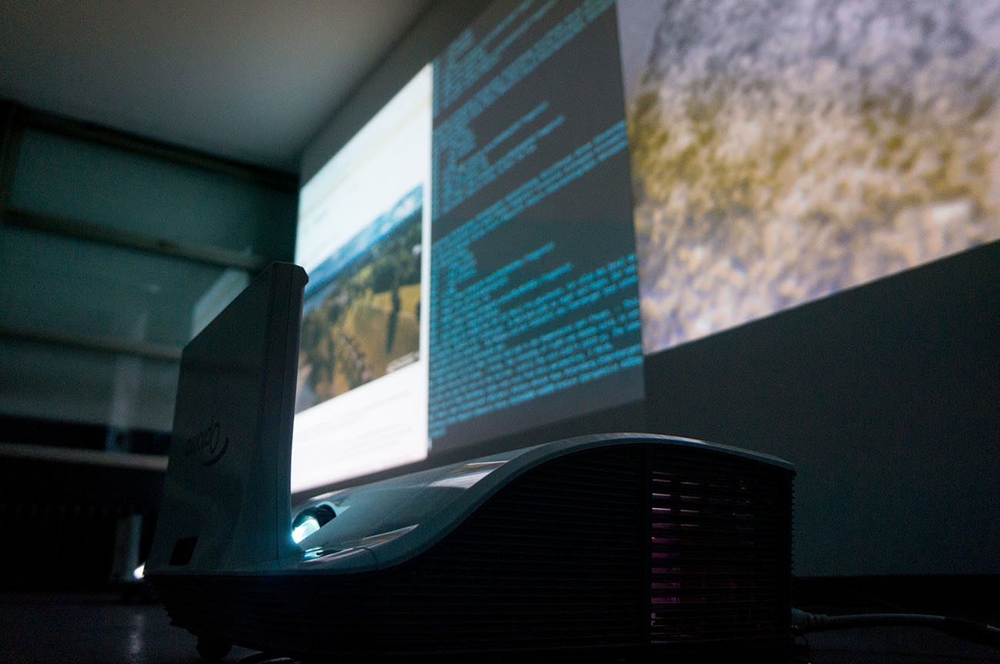
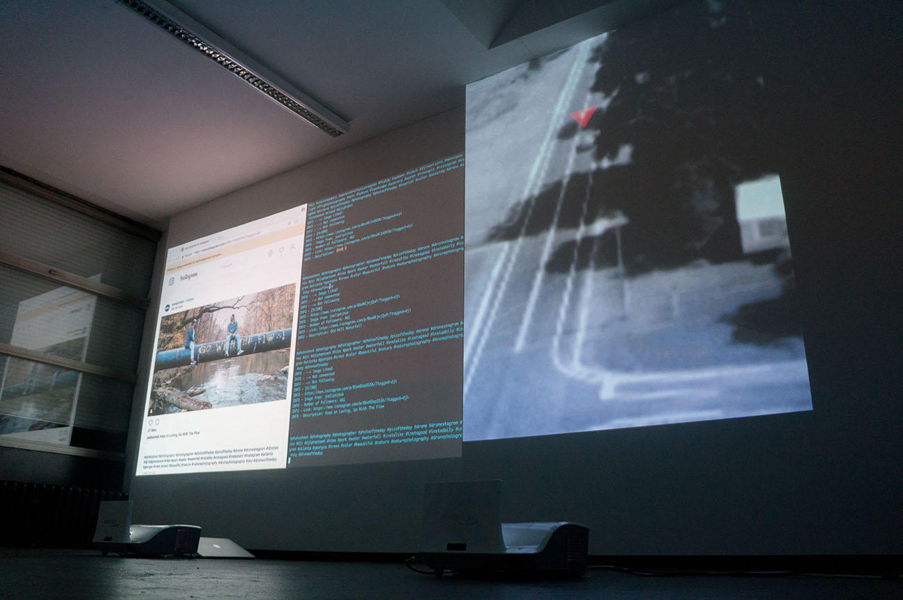
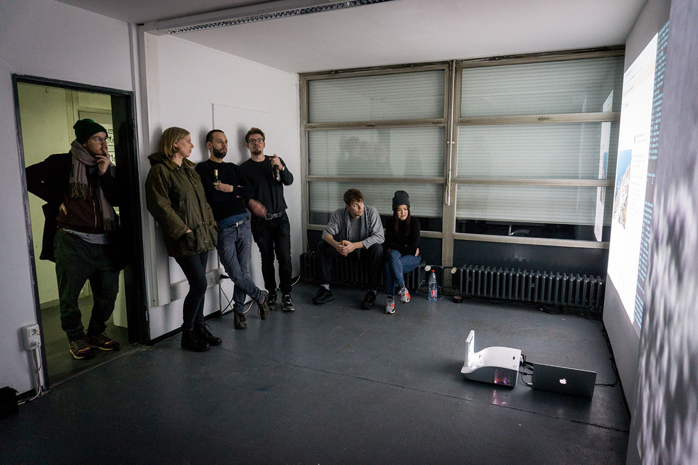
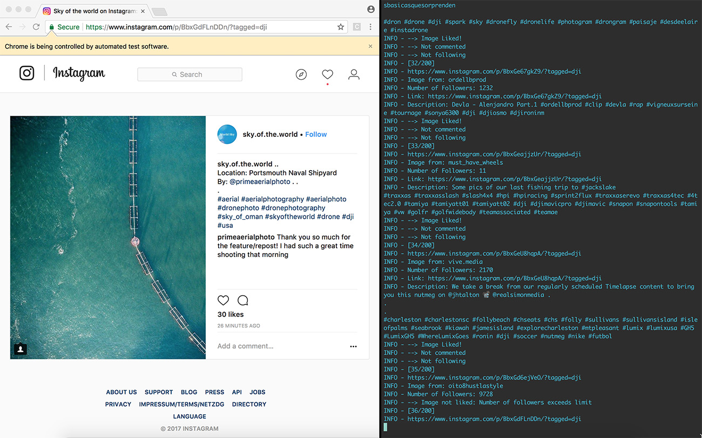
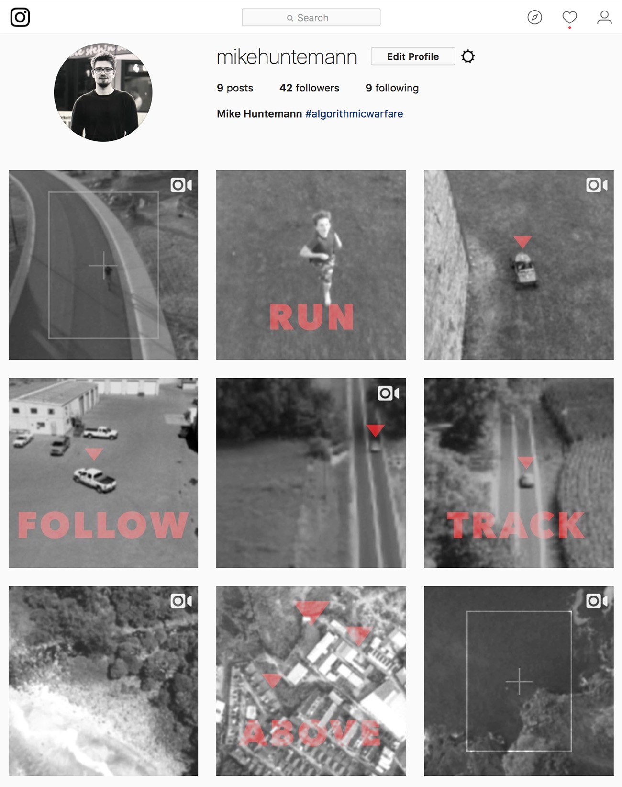
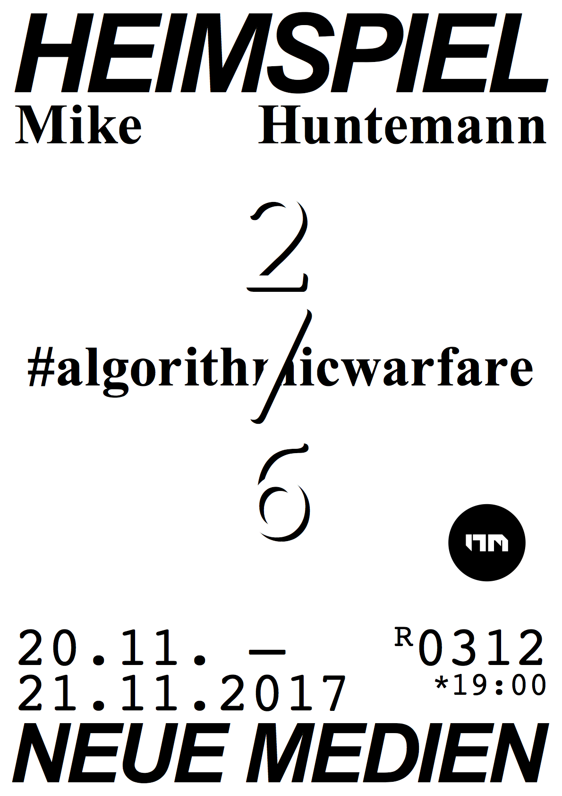

Date: 2017/11/20  
Authors: [Mike Huntemann](http://mikehuntemann.de/)  
Keywords: drones, technology, dji, phantom, mavicpro, military, algorithm

---
---
# #algorithmicWarfare Preview

\#algorithmicwarfare Chapters 1 - 4
Video-Installation, 5 Min, Stereo, Loop
Instagram Bot Live Performance
Talk & Critique Session

[Read More](/mike-huntemann-algorithmic-warfare)

---

Heimspiel. Bi-weekly public solo exhibitions at New Media Kassel.

Every second week a student of New Media exhibits works in our 15 sqm
dedicated gallery space. The 'Home Game' series helps the students to
test run ideas and to gain experience in planning and setting up works.
In a public critique process the class and visitors then discuss the show.
