# Access to Bodies Workshop

Type: Workshop
Date: 2017/11/21
Authors: [Nadja Buttendorf](http://nadjabuttendorf.com/)
Keywords: access, body, cyborg, post human

---
---

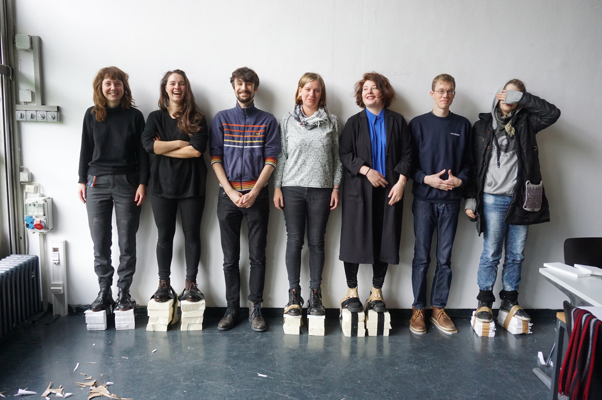

**Workshop: Neue Medien, Viskom R311**

21.11. 10:00 - 17:00 Uhr
22.11. 10:00 - 13:00 Uhr

Der workshop ist offen für alle Studienbereiche!
* Plakat by Johannes Strüber.

## Part 1: ACCESS TO BODIES
⚡ Geil, wir gehen alle in den Norm Body Shop! ⚡

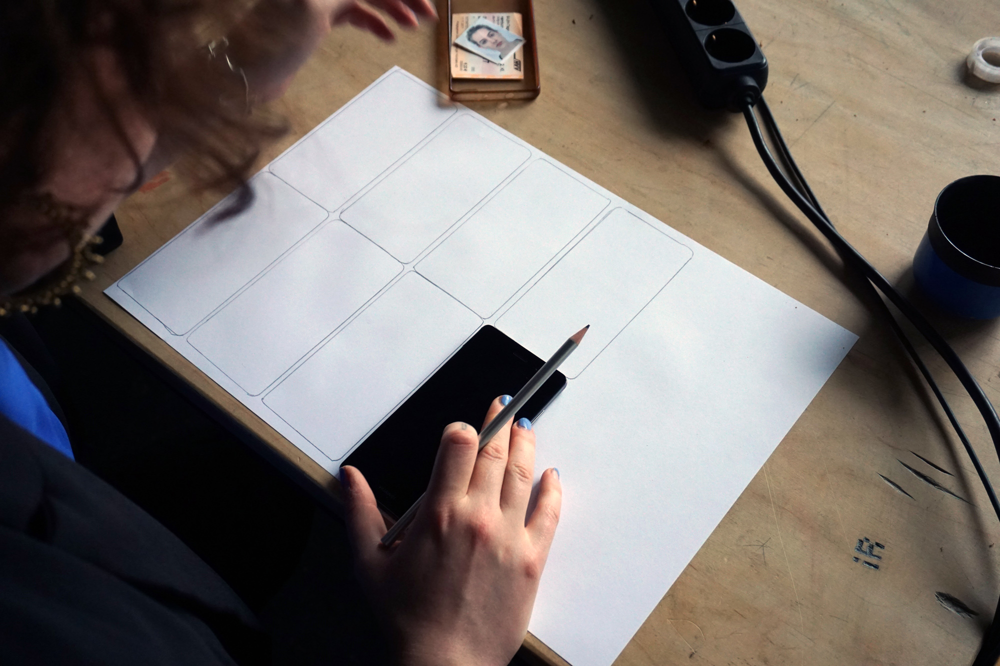

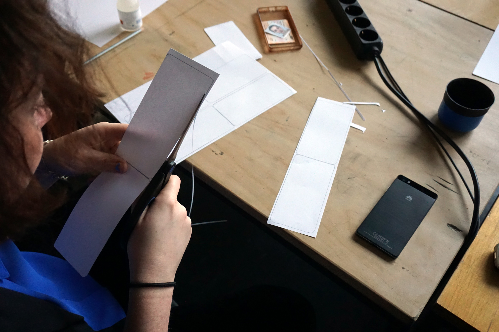

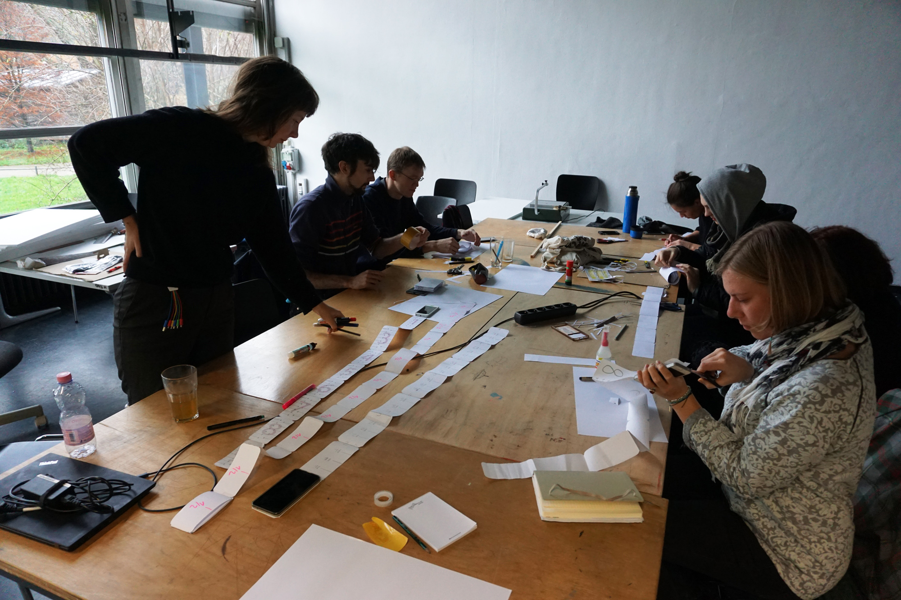

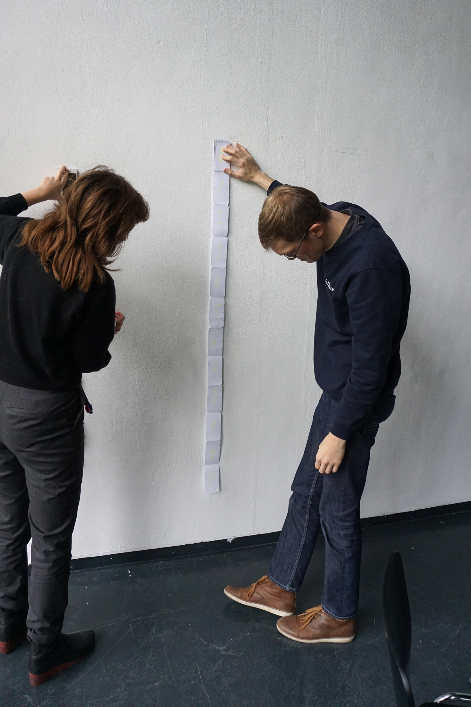

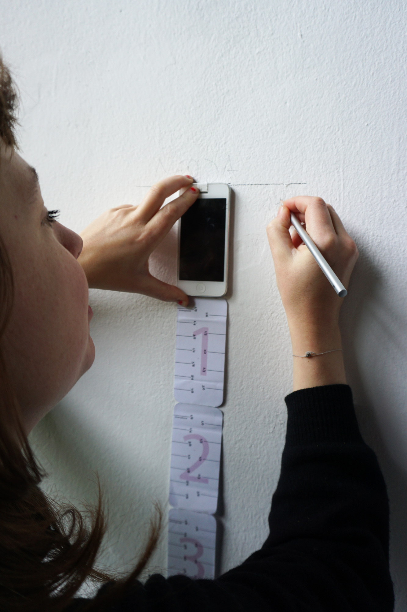

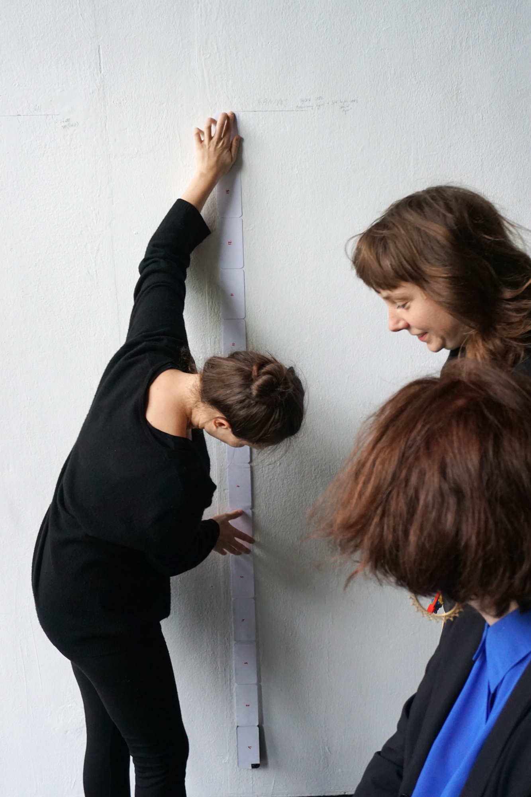

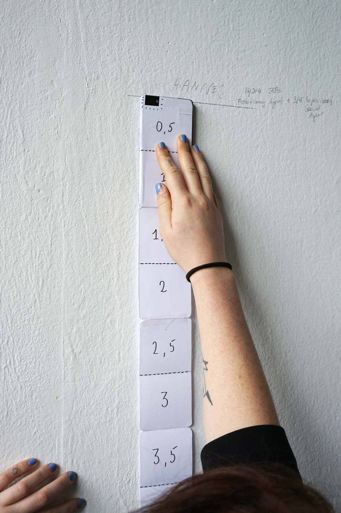

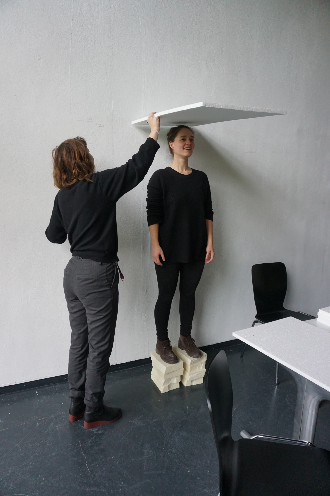

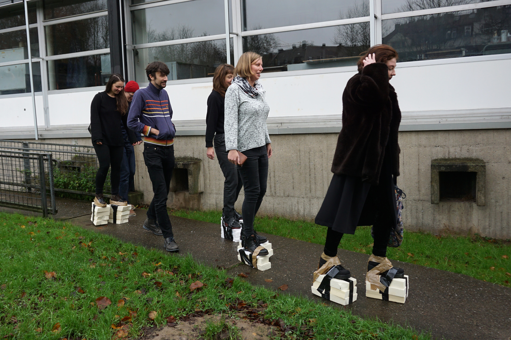

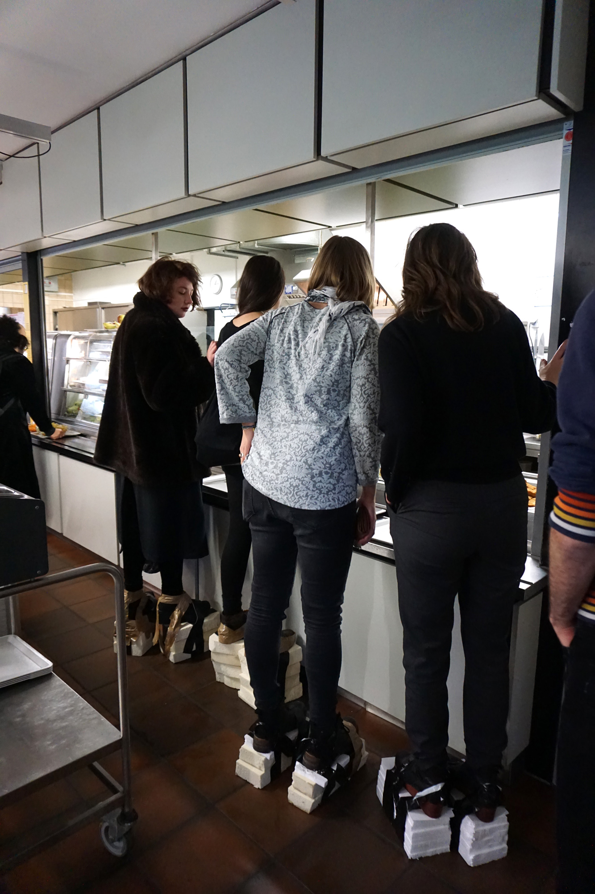

## Part 2: EXCESS TO BODIES

Unser Körper ist der Sensor zur äußeren Welt. Wir nehmen Information
durch unseren Körper auf und verarbeiten sie eben da. Dadurch erschaffen
wir uns eine gemeinsame Realität über die wir kommunizieren. Wenn unsere
Körper eine andere Physiognomy hätten, würden wir die Welt anders sehen?

<iframe width="560" height="315" src="https://www.youtube.com/embed/PmhFil4yKG4" frameborder="0" gesture="media" allow="encrypted-media" allowfullscreen></iframe>

<iframe width="560" height="315" src="https://www.youtube.com/embed/5U2IIseJcrA" frameborder="0" gesture="media" allow="encrypted-media" allowfullscreen></iframe>

<iframe width="560" height="315" src="https://www.youtube.com/embed/z4o3yhubZBk" frameborder="0" gesture="media" allow="encrypted-media" allowfullscreen></iframe>

<iframe width="560" height="315" src="https://www.youtube.com/embed/yJTCI4fSOZY" frameborder="0" gesture="media" allow="encrypted-media" allowfullscreen></iframe>
