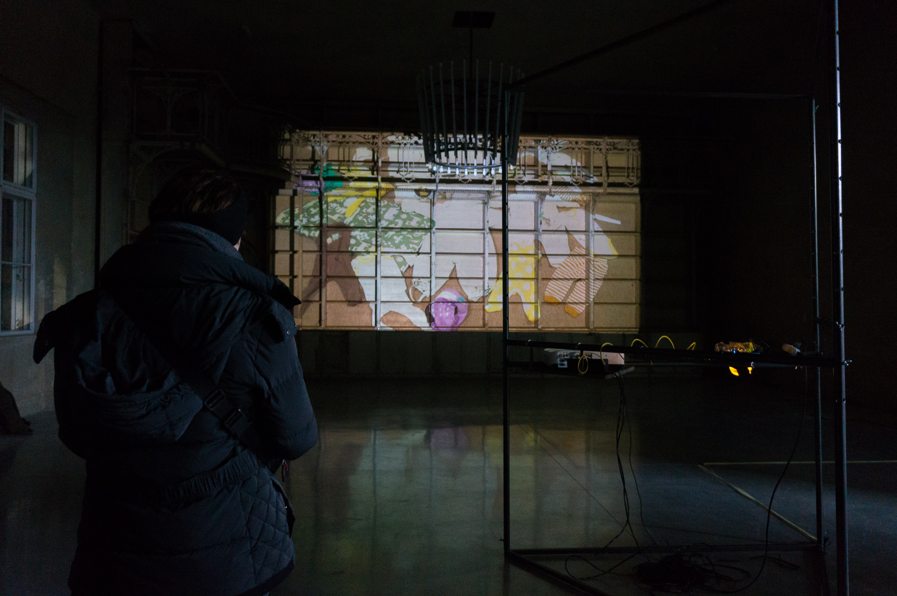
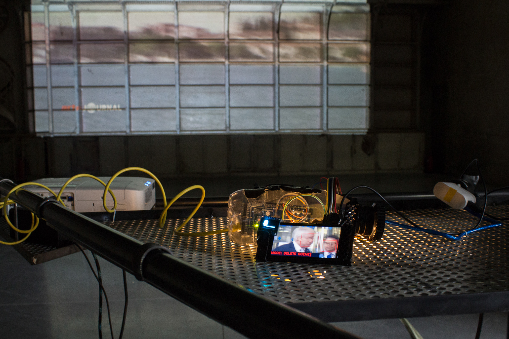
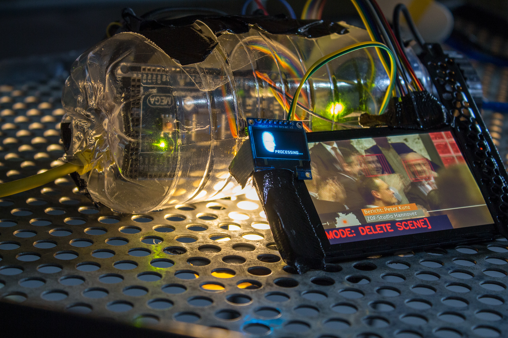
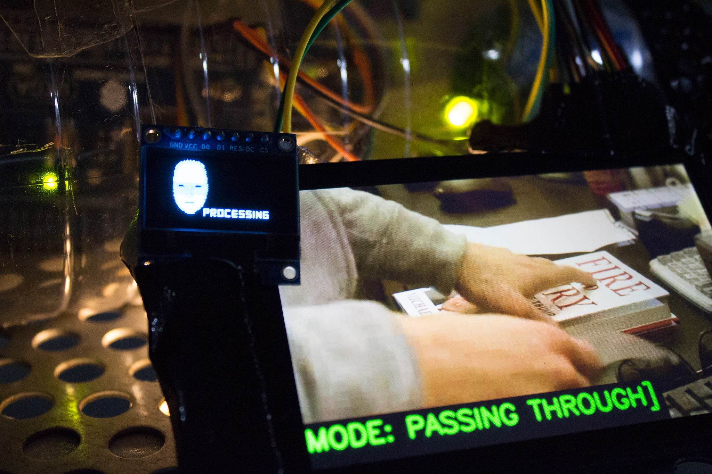

Date: 2018/02/19
Authors: Christopher Casper
Keywords: Projektion, Video, Installation, Custom Electronic

---
---

# Wesan

Nachrichten, ständig und überall. Leiden Sie schon unter Nachrichten-Erschöpfung und ertappten sich bei dem heimlichen Wunsch, am liebsten gar keine Nachrichten mehr mitzubekommen, denn diese handeln ja doch immer irgendwie davon was Trump jetzt schon wieder twitterte oder weil jede neue Nachricht dieses ständige Gefühl von Sorge und Ohnmacht verstärkt? Ein Gesichtserkennungsalgorithmus untersucht einen Stream von Nachrichtenprogrammen und löscht automatisch alle Szenen mit Gesichtern. Personen kommen nur noch als Hinteransichten vor oder wenn sie so klein sind, dass sie durch die Gesichtserkennung durchrutschen. Übrig bleibt eine Aneinanderreihung von Szenen des Übergangs und Lückenfüllens, der Überblicke und Illustrationen. Es sind Nachrichten-Landschaften, die ohne Protagonisten auskommen müssen. Der verbleibende Videoutput ist oft stakkatoartig, kann aber durchaus gleichzeitig in gewisser Weise meditativ sein. Diese Art Nachrichten-Eskapismus wird zusätzlich durch einen unterschwelligen Soundtrack unterstützt.

