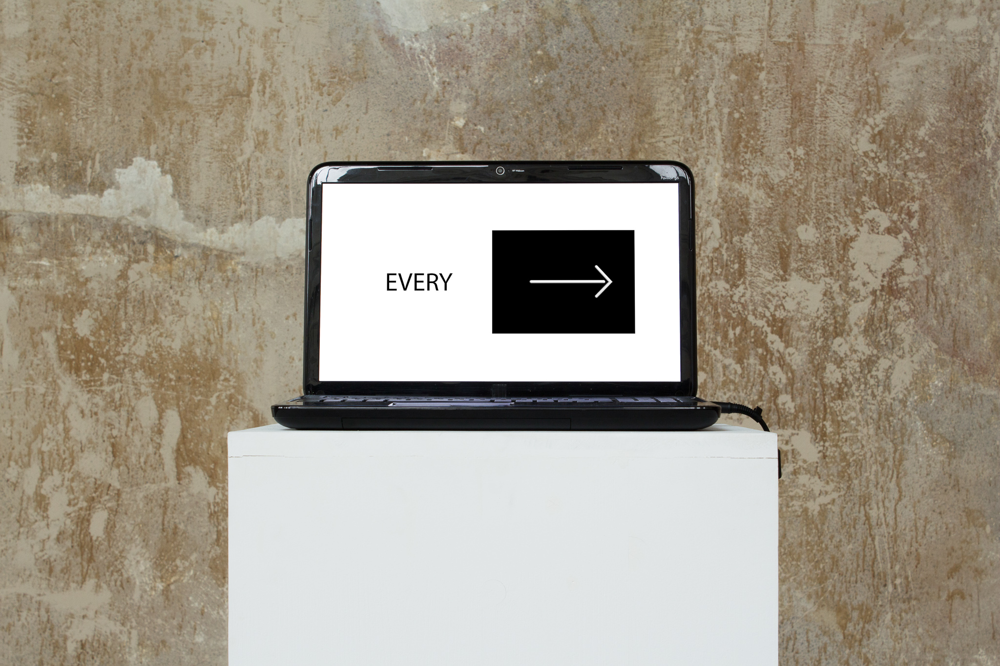

Date: 2018/02/19
Authors: Didem Sandıkcı
Keywords: Installation, Laptop, Website

---
---

# Every Center Changes In Every Six Seconds

Im Cyberspace gibt es Milliarden von Verbindungen die nur wenige Klicks von einander entfernt sind. Allein im Darknet beträgt die Anzahl der Webseiten 1.208.925.819.614.629.174.706.176 (lt. www.onions.system33.pw) selbst diese Zahl ist schwer zu lesen. Wir wissen, dass das Internet von großen Unternehmen wie Google, Facebook oder Amazon beherrscht wird, aber die stetig wachsende Zahl von Online-Plattformen macht es unmöglich, über ein Zentrum des Internets zu sprechen. Wenn eines dieser großen Unternehmen oder eine seiner viel besuchten Websites geschlossen würde, würde sofort ein anderes ähnliches eröffnet werden. Aus diesem Grund ist es in naher Zukunft nicht möglich, über ein permanentes Zentrum im Cyberspace zu sprechen. Die Arbeit “Every Center Changes in Every Six Seconds” besteht aus einer schnellen Wiederholung desselben Satzes und einem sich horizontal bewegenden Pfeilsymbol. Der Titel bezieht sich auf Ted Nelsons berühmtes "Alles ändert sich alle sechs Wochen", in dem er darauf hinweist, wie technologische Entwicklungen unserem Leben neue Impulse verleihen und der horizontal bewegliche Pfeil bezieht sich auf das stetig wachsende Reich des Internets. Durch diese sich wiederholenden Bilder möchte ich die zweideutige Position des Menschen in der sich ausbreitenden Netzwerkaera hervorheben.

