# Don't Show Again!

Date: 2018/02/19
Type: Exhibition
Authors: Nicole Brauer, İpek Burçak, Echo Can Luo, Christopher Casper, Hannes Drescher, Stefan Endres, Robin Höke, Mike Huntemann, Saskia Kaffenberger, Jonas Leichsenring, Naima Omari, Didem Sandıkcı, Mario Strahl

---
---

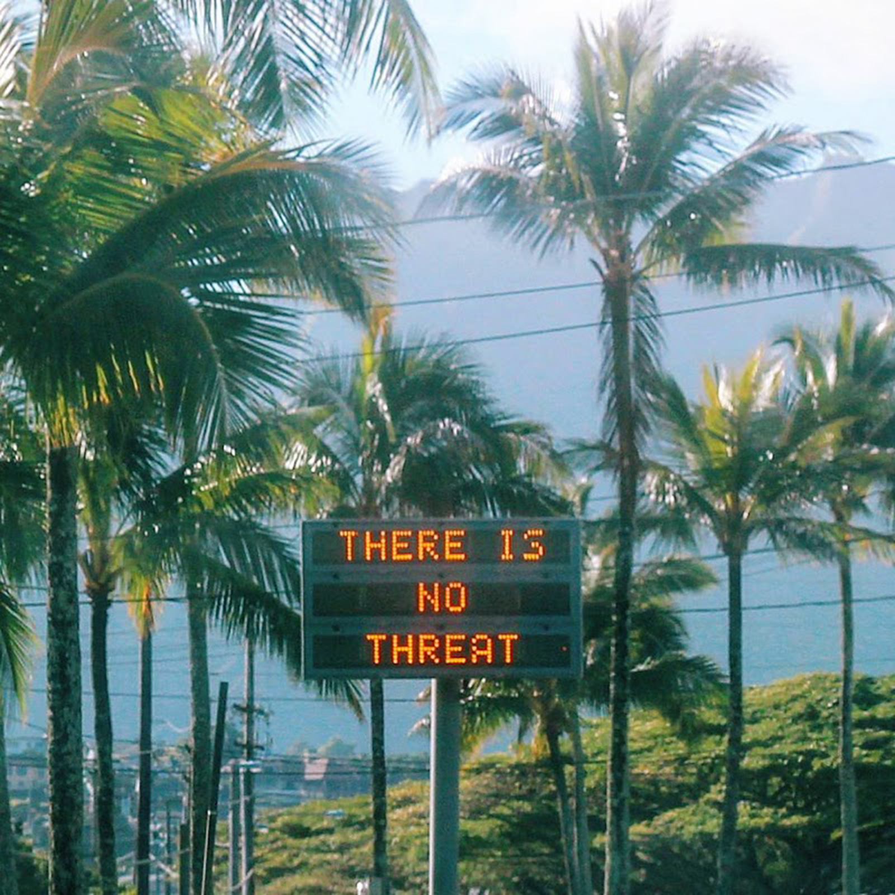

Constant alerts, requests, and notifications keep us immersed in information flowing daily across our screens. Little windows appear at the monitor’s edge and jump onto smartphone taskbars; milky overlays interfere with viewing entire web pages.

It is down to attention. User attention is now the most valuable commodity on the Internet. The online advertising industry is in real crisis. Only the biggest advertising monopolies–Google and Facebook–can still benefit from advertising revenue, while all others are left with nothing. Social media networks are saturated, user numbers are stagnating; there is an increasing fatigue with liking, sharing and posting because too many services, news items, and friend requests are competing for our attention. It seems as if faith in what is presented to us on screens is diminishing. “That’s fake” is the new standard. A limited number of meme-like headlines get global attention while important issues sink without a trace. We spend on average up to three hours a day on smartphones only to ask ourselves later what we actually achieved.

New Media students of Kunsthochschule Kassel deal with questions of attention, identity, and the use of media in a variety of ways. How do images and topics appear and spread through the Internet? What role does the screen play as a limit to understanding, and how will automation continue to change society? Overcoming the post-digital regime of attention will require new ideas and concepts that the technology-centered efficiency logic of internet platforms can never provide.

## Participating Students
Nicole Brauer, İpek Burçak, Echo Can Luo, Christopher Casper, Hannes Drescher, Stefan Endres, Robin Höke, Mike Huntemann, Saskia Kaffenberger, Jonas Leichsenring, Naima Omari, Didem Sandıkcı, Mario Strahl,
Video program: Lucie Friederike Müller, Jacob Höfle, Lisa Dreykluft, …

[dontshowagain.online](http://dontshowagain.online) website by Stefan Endres

 
## Reaktor, Wien
Vernissage: 19. Februar 2018, 19:00 Uhr  
Öffnungszeiten: 20. Februar 2018, 10:00 – 16:00 Uhr  
Geblergasse 40, 1170 Wien  
[www.reaktor.art](https://www.reaktor.art/)

---

## world record

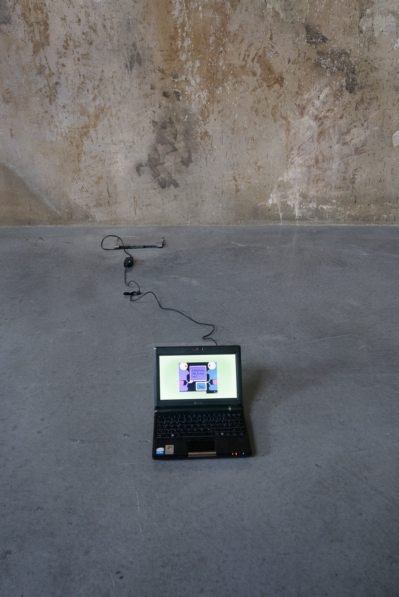

[Read More](/nicole-brauer-world-record)

---

## prologue to the 'autistic turn'

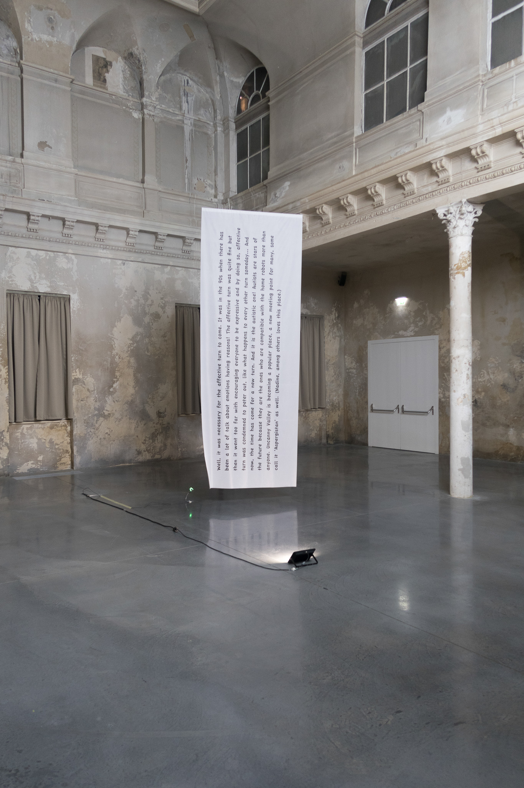

[Read More](/ipek-burcak-prologue-to-the-autistic-turn)

---

## Nicely nicely all the time! – Nr. 1

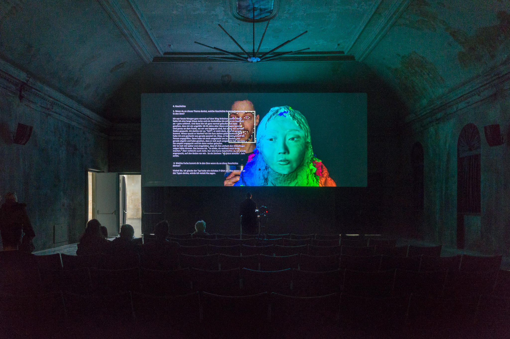

[Read More](/echo-can-luo-nicely-nicely-all-the-time-nr1)

---

## Wesan

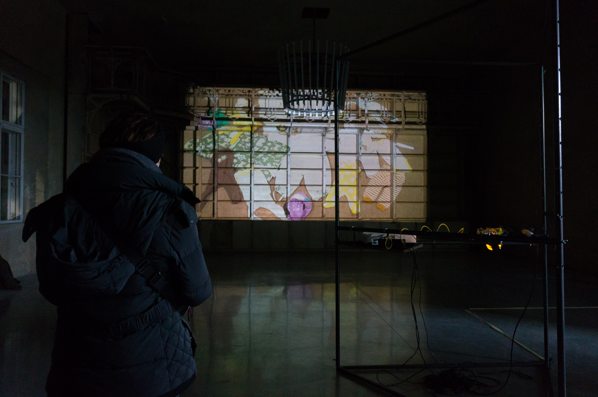

[Read More](/christopher-casper-wesan)

---

## arch_neighbours

[Read More](/hannes-drescher-arch_neighbours)

---

## self-site

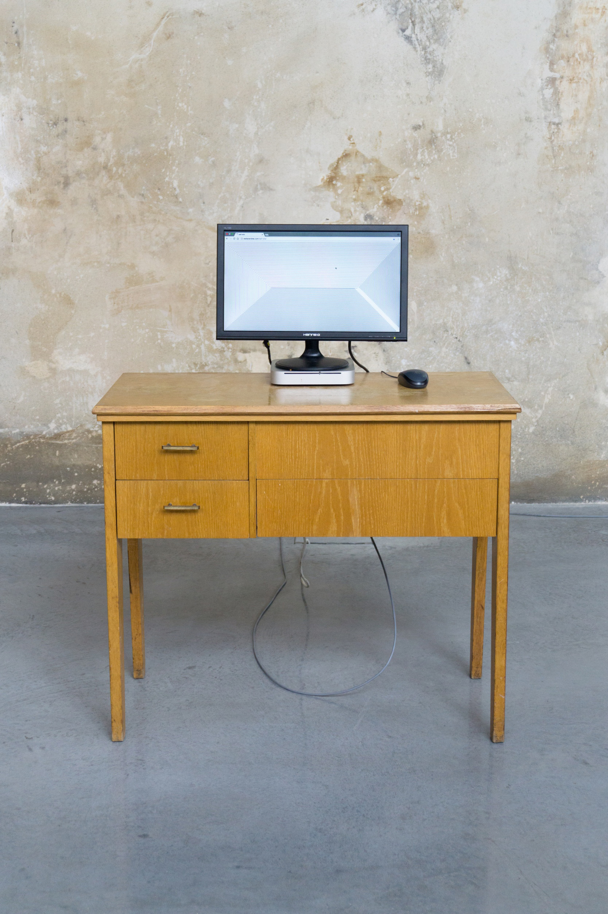

[Read More](/stefan-endres-self-site)

---

## flat earth

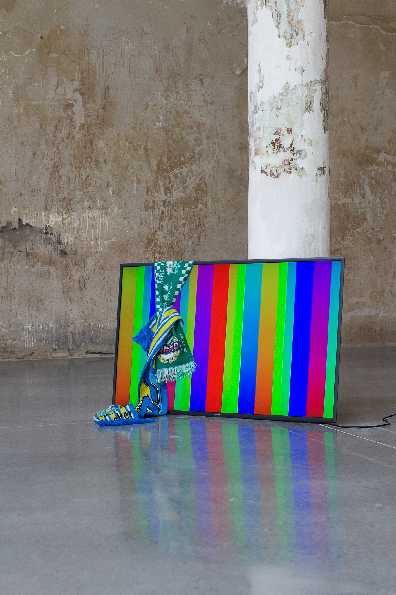

[Read More](/robin-hoeke-flat-earth)

---

## #algorithmicWarfare

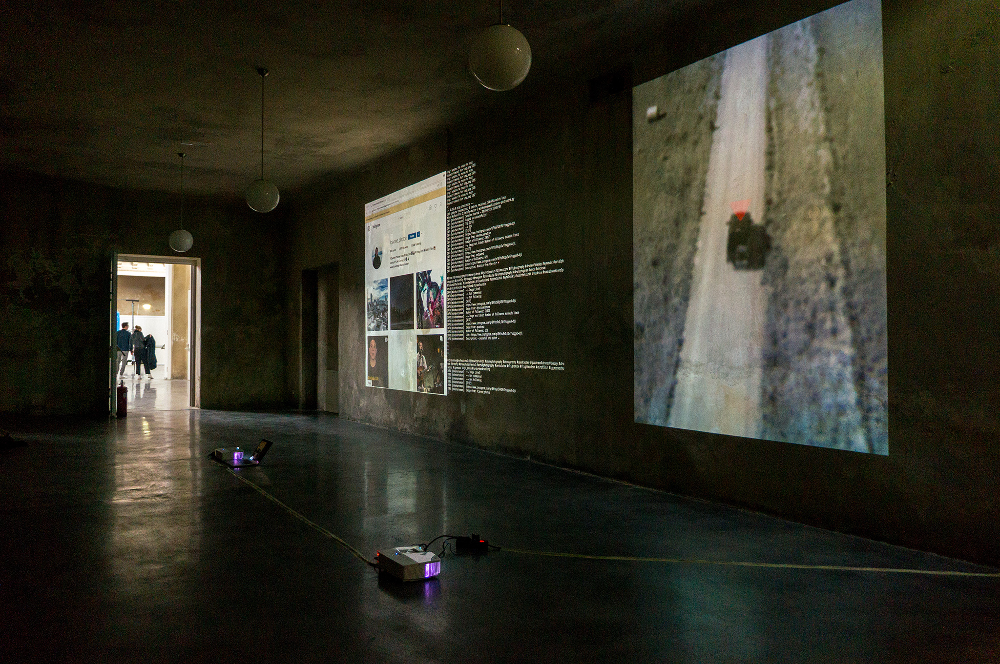

[Read More](/mike-huntemann-algorithmic-warfare)

---

## Differenzschwelle

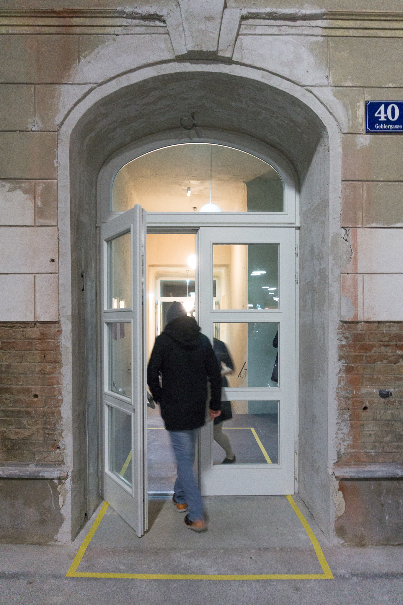

[Read More](/saskia-kaffenberger-differenzschwelle)

---

## Why always me?

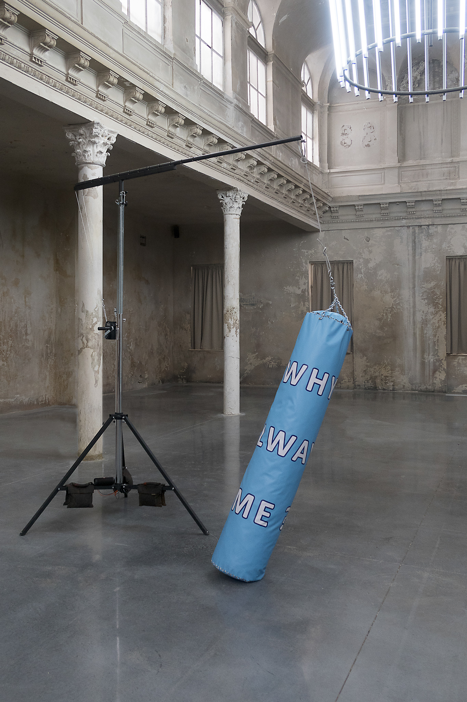

[Read More](/jonas-leichsenring-why-always-me)

---

## chained to the algorithm

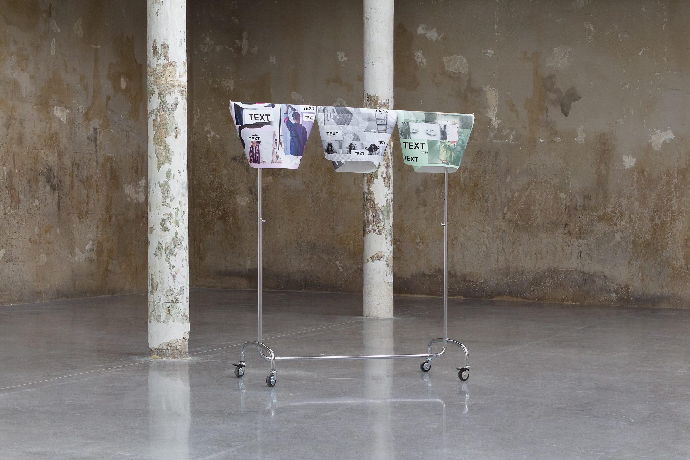

[Read More](/naima-omari-chained-to-the-algorithm)

---

## Every Center Changes In Every Six Seconds

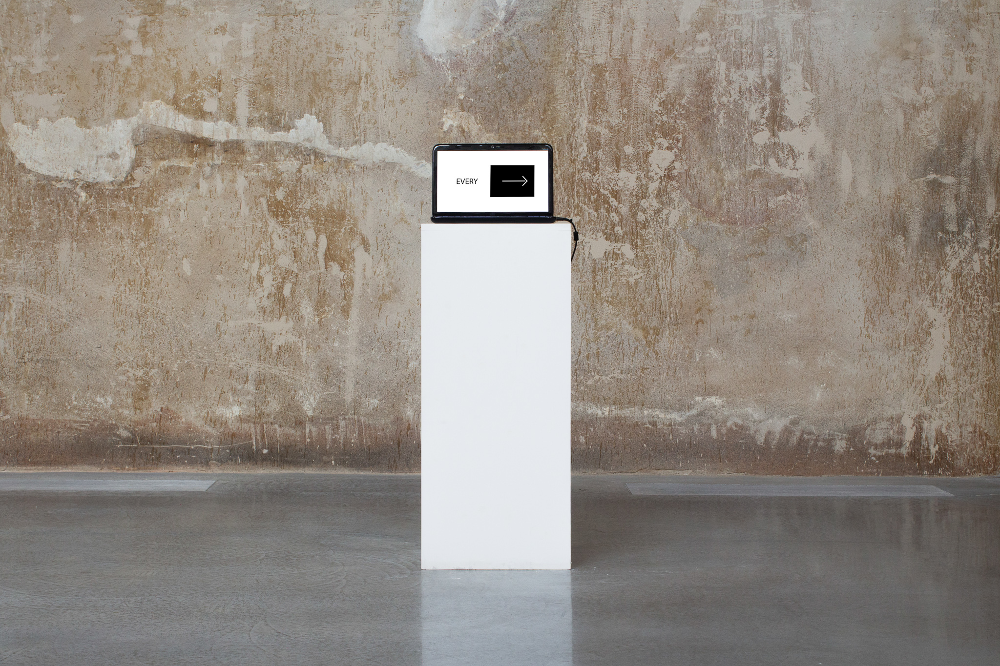

[Read More](/didem-sandikci-every-center-changes-in-every-six-seconds)

