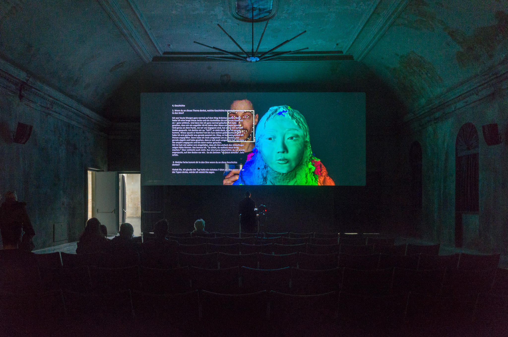
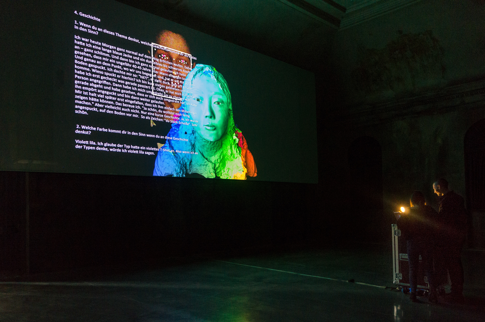
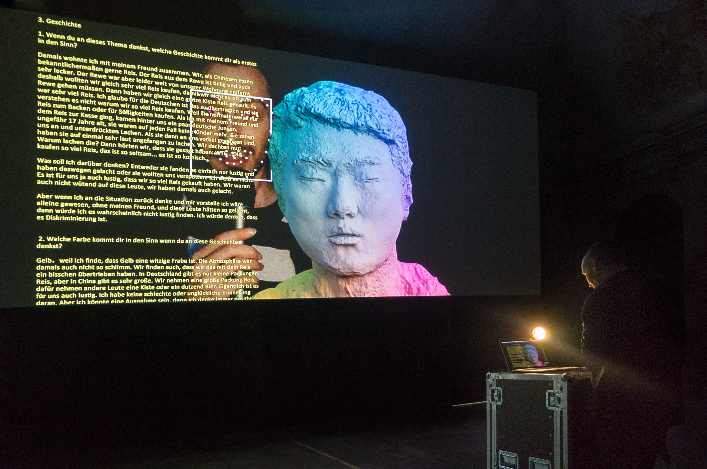

Date: 2018/02/19
Authors: Echo Can Luo
Keywords: 3D Avatar Performance, Installation

---
---

# Nicely nicely all the time! – Nr. 1

In Deutschland leben viele Menschen mit unterschiedlicher Herkunft. Die meisten davon haben schon Erfahrungen mit Diskriminierung und Rassismus erlebt. Um in dieses Thema weiter einzusteigen habe ich Interviews mit einigen Betroffenen geführt und eine Reihe von Gesichtern 3D eingescannt um diese als interaktive Avatare dem Publikum zur Verfügung zu stellen. Während die Besucherin oder der Besucher eine der Geschichten aus den Interviews am Mikrofon vorließt, wird das Gesicht durch das eines der animierten Avatare ersetzt. In anderer, virtueller Haut werden Erfahrungen neu erlebt.

