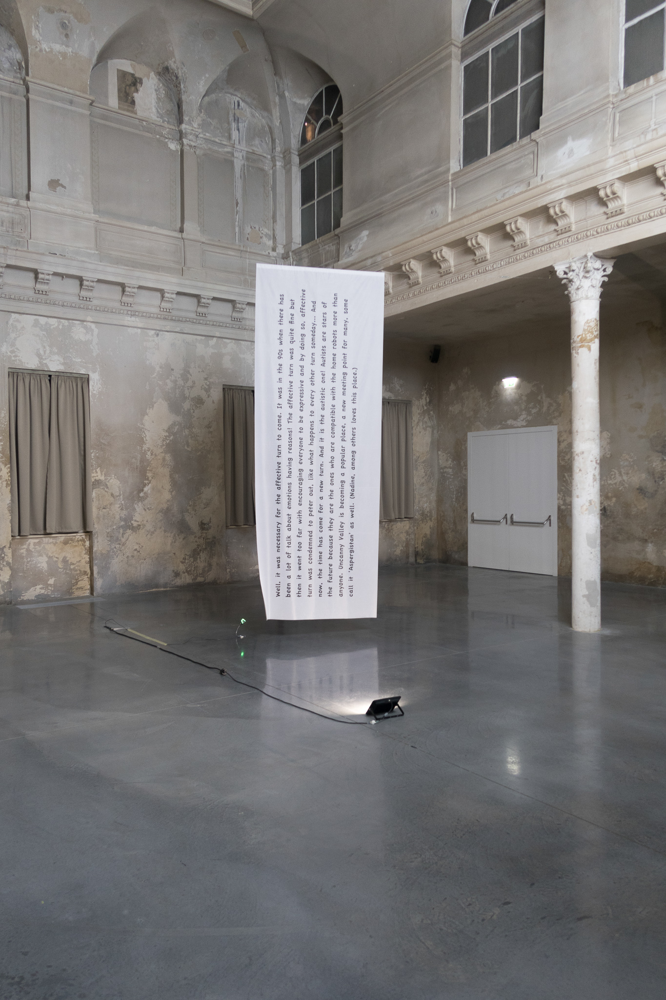
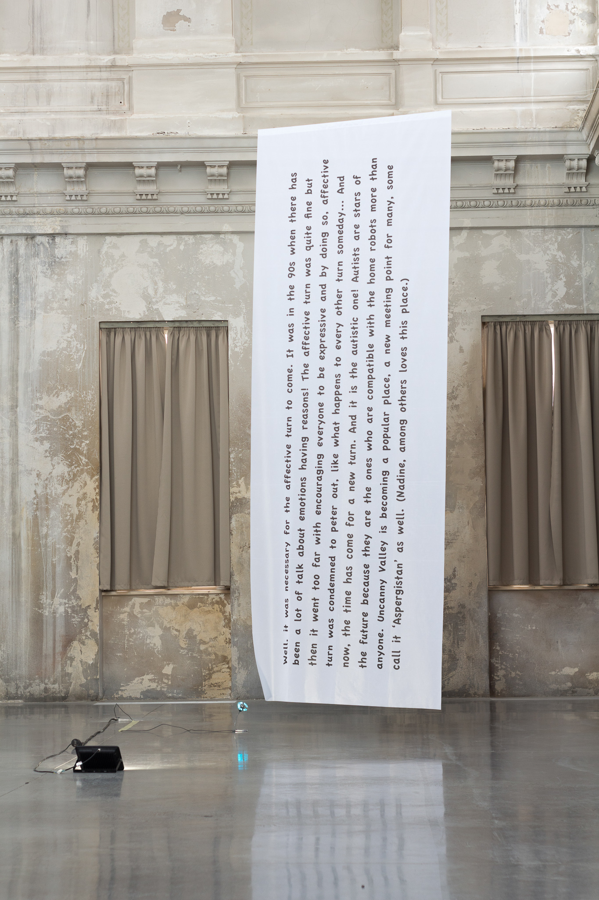
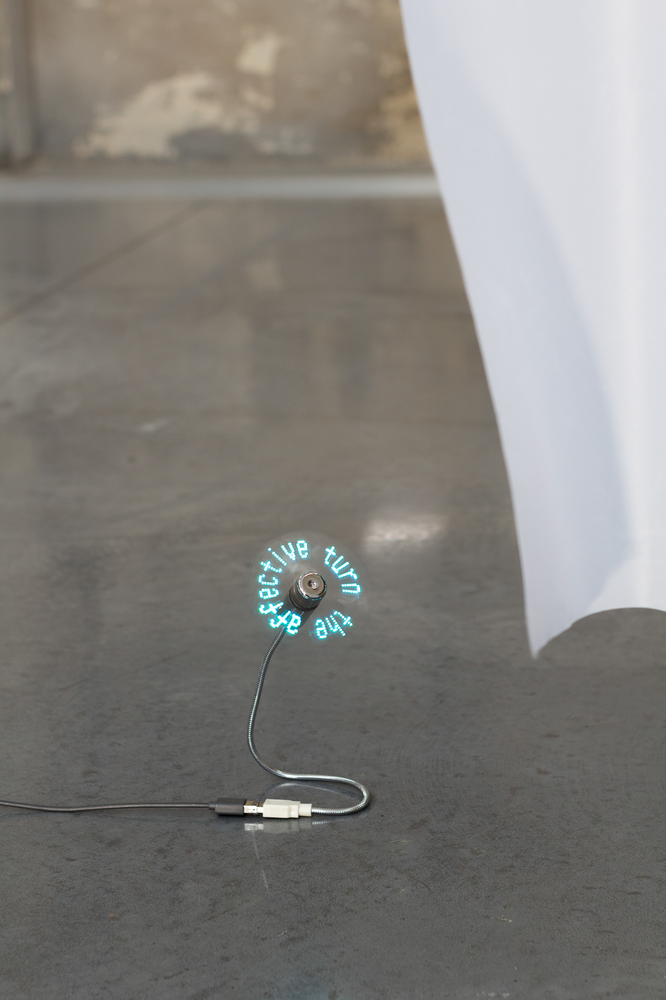

Date: 2018/02/19
Authors: Ipek Burçak
Keywords: Installation, Fahne, Ventilator

---
---

# prologue to the 'autistic turn'

> …die Autistische Wende ist da. Nach der autistischen Wende ist nichts mehr wie vorher…

‘Autistic Turn’ ist ein Buch, in dem es sich um die Geschichte des affektiven Computing im spekulativ-fiktiven Stil handelt. In dem Buch befinden sich u.a. osmanisch-griechische Vampire aus dem 18. Jhdt, Telefonzellen aus schamanistischer Zeit in Anatolien und RoboterhundInnen, die keine RoboterkatzenfreundInnen haben. ‘Autistic Turn’ wird im Sommer 2018 in in den Regalen eintreffen.

