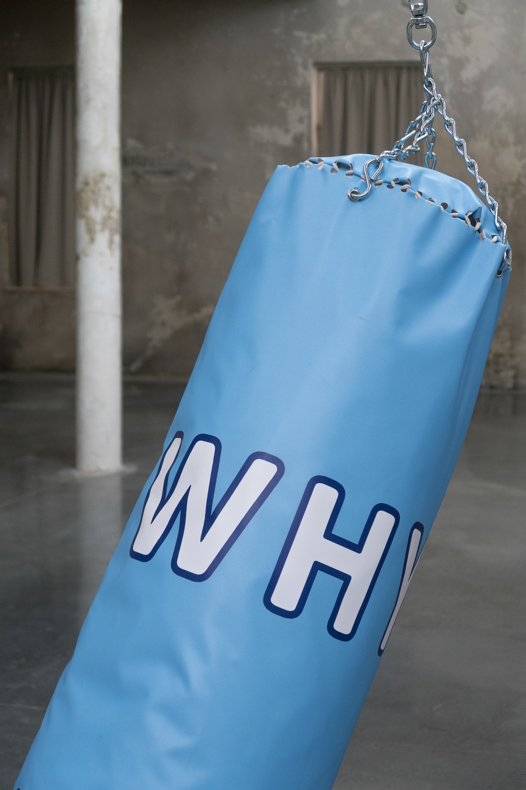

Date: 2018/02/19
Authors: Jonas Leichsenring
Keywords: Boxsack, Audio, Mixed Media

---
---

# Why always me?

Am 23. Oktober 2011 in der 22. Minute schießt der Fussballer Mario Balotelli  das 1:0 gegen den Stadtrivalen Manchester United. Doch Balotelli jubelt nicht, er erstarrt, dreht sich um und zieht sich sein Trikot über den Kopf. Auf dem T-Shirt darunter steht: "Why always me" - warum immer ich? Zwei Nächte vor dem historischen 6:1-Sieg gegen ManU war in seinem Haus ein Feuer ausgebrochen. Um ein Uhr nachts hatte Feuerwerk einen Brand verursacht - in seinem Badezimmer. Immer wieder fällt der Sohn ghanaischer Einwanderer negativ auf. Der italienische Stürmer ist bekannt für seine Eskapaden auf und neben dem Platz. Doch hinter dem Kindskopf steckt ein junger Mann, der nicht damit umgehen kann, dass er sein ganzes Leben gehasst wurde. Viele Anhänger verschmähen ihn trotz guter Leistung vor allem wegen seiner Hautfarbe. Dazu kommt sein impulsives Verhalten beim Training und im Privatleben. Den Hass hat Mario Balotelli nie verstanden. Im Internet finden sich tausende von Bildern, so genannte Memes, die in Collagen und GIF-Animationen in mitunter stark rassistischer Weise sich über Balotelli und seine Posen lustig machen. 

Wie mancher Musikstar versteckt und schützt er sich hinter offen zur Schau getragener Arroganz und unverstandenen Aktionen, die noch mehr Aufmerksamkeit erzeugen. In seiner gespielten stereotypen Übermännlichkeit nimmt Balotelli es mit seinen Gegnern und den Fans auf, es ist das einzige was in schützt.

