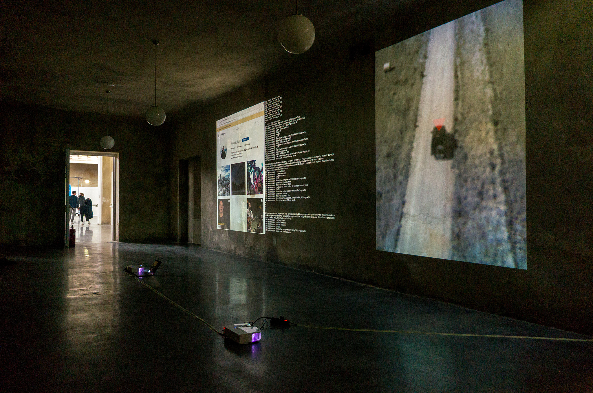
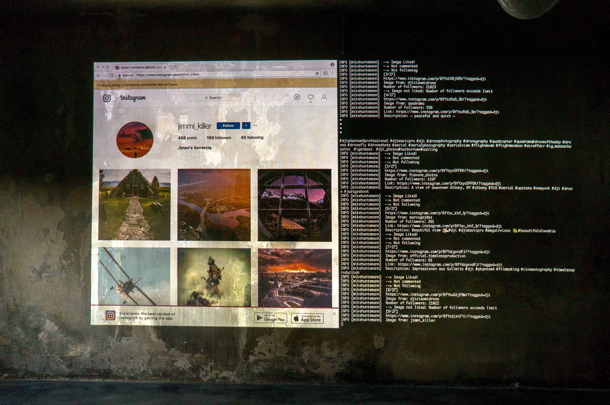
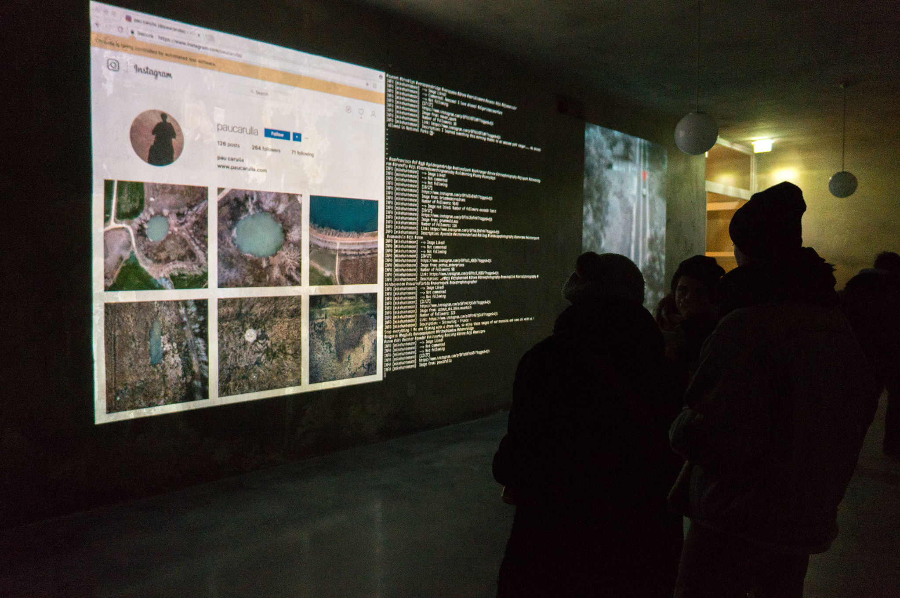
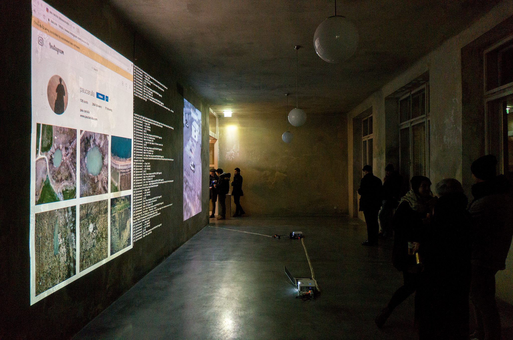

Date: 2018/02/19
Authors: Mike Huntemann
Keywords: Video, Installation, Performance

---
---

# #algorithmicWarfare

Im März 2016 stellte der chinesischen Hersteller DJI die Consumer-Filmdrohnen der Phantom 4 Serie vor. Diese erhielt zusätzliche Sensoren, die in Verbindung mit einem Software Update (teil-)autonome Flugmanöver möglich machen. Mit dem “Intelligent Flight Mode” der DJI App, stehen dem Drohnen-Operator Features wie “Active Track” oder “Point of Interest” zur Verfügung. Ein einfaches Berühren des Bildschirms genügt, um das gewünschte Objekt aus größerer Distanz filmisch zu begleiten. Diese algorithmisch unterstützen Praktiken sind im US-Militär bereits mehrere Jahre im Einsatz. “Track and Follow” ist nur eine der operativen Möglichkeiten der General Atomics MQ-1 Predator Drohne, welche inzwischen der wichtigste Bestandteil der taktischen Luftraumaufklärung geworden ist, um feindliche Ziele ausfindig zu machen und über enorme Strecken unbemerkt zu verfolgen - gegebenenfalls sogar zu eliminieren.

Die Instagram Video Serie #algorithmicWarfare basiert auf Found Footage Videomaterial der Phantom 4, welche in Testflügen der autonomen Features entstanden sind.  Mensch und Objekt werden über mehrere Minuten und Kapitel verfolgt, grafische Elemente markieren ihre genaue Position am Boden. Parallel zum Video ist ein Algorithmus in einer Live-Performance aktiv, der auf der Social Media Plattform Instagram in der DJI-Community (#dji) potentielle Follower für die #algorithmicWarfare Video Serie aufspürt und diese im zweiten Schritt mit Likes und Kommentaren bombardiert.

<iframe src="https://player.vimeo.com/video/259128711?title=0&byline=0&portrait=0" width="500" height="281" frameborder="0" webkitallowfullscreen mozallowfullscreen allowfullscreen></iframe>

