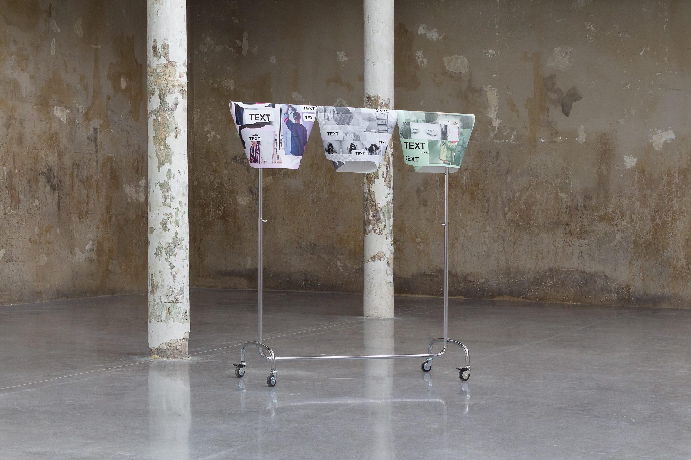
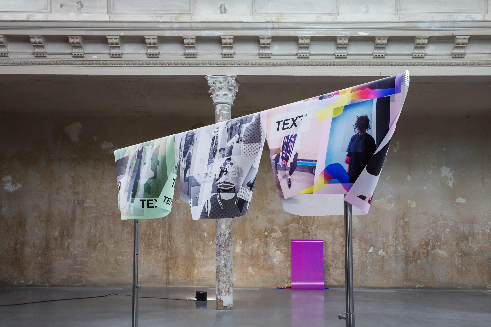
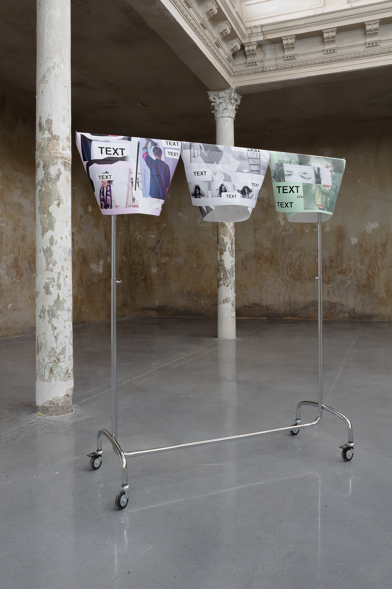

Date: 2018/02/19
Authors: Naima Omari
Keywords: Installation, Fotostrecke, Kleiderstände, Video

---
---

# chained to the algorithm

"Du kannst dir heute aussuchen, wer du sein willst." Im Zeitalter der digitalen Anonymität ist es von entscheidender Bedeutung sich seines analogen Selbst bewusst zu werden. Wo stehe ich im Internet? Wer bin ich sowohl digital als auch analog? Kooperieren diese beiden Identitäten miteinander? Oder sind es zwei gespaltene Abzweigungen der Persönlichkeiten? Welche Absichten verfolge ich mit meinem digitalen Vorgehen? Welche Möglichkeiten eröffnen sich mir durch das Internet? In meiner aktuellen Diskussion geht es um das Internet, dessen Nutzung und der subjektiven Auseinandersetzung mit der Frage: Bin ich ich oder bin ich du? Wie kannst du mich digital beeinflussen? Analog trifft auf Digital. Fremde werden zu Freunden. Fremde werden zu Liebenden. Fremde werden zu einem Teil meiner eigenen Identität. In Form von kollektiven Gedanken, die als TEXT markiert wurden, Kleidungsstücken, die ich als Stellvertreter für die Erfahrungen mit den Menschen anziehe oder Emotionen, die in Kommunikation dadurch entstehen. Aber was macht das Internet mit mir? Welche Vor- und Nachteile eröffnen sich durch diese unerschöpfliche Quelle von Identitäten? Gibt es eine Balance zwischen der Eigen- und Fremdidentität? Sowohl Film als auch Fotos sollen Einblick in meine Auseinandersetzung geben. but: your answer? 

