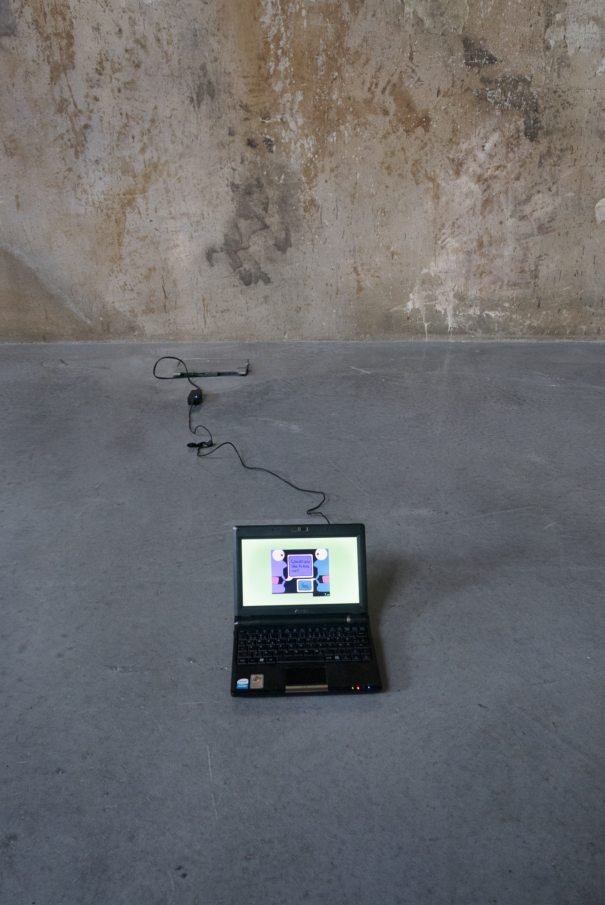

Date: 2018/02/19
Authors: Nicole Brauer
Keywords: Video, Screen Capture Computer Games

---
---

# world record

<iframe width="560" height="315" src="https://www.youtube.com/embed/CGFQTOu1EAo?list=UUqsKGab0BGce6xYWE0rB1qw" frameborder="0" gesture="media" allow="encrypted-media" allowfullscreen></iframe>

[youtube.com/channel/UCqsKGab0BGce6xYWE0rB1qw](https://www.youtube.com/channel/UCqsKGab0BGce6xYWE0rB1qw)
  
Speedrunning ist eine Spielpraxis, bei der es darum geht ein digitales Game (etwa ein Videospiel) so schnell wie möglich durchzuspielen. Neben brutalem Koordinations- und Durchhaltevermögen nutzen Speedrun Spieler\*innen häufig Exploits und Programmierfehler aus, mit denen sie große Teile des Game überspringen oder anders dekonstruieren, um zu ihrem Ziel zu kommen.  
  
Ein wichtiger Bestandteil der Speedrunning-Ästhetik ist der Timer, welcher vom ersten Input an bis zum letzten die Dauer der Spielzeit misst. Anhand dessen vergleichen sich Speedrunner\*innen in ihren Bestzeiten und können bezeugen wer den Weltrekord (also die beste, schnellstmögliche Durchspielzeit) in einem Game hält.  
  
world record ist ein Zusammenschnitt mehrerer eigens erstellten Speedruns von Games, welche aus experimentellen und queeren Kontexten kommen. Oft haben die gezeigten Games kein binäres Ende oder eine feste Zielsetzung. Da diese Games weitaus unbekannter sind und nicht im typischen "Gamer"/Speedrun Kontext vorkommen, wurden sie bislang noch nie als Speedrun gespielt und werden es wahrscheinlich auch nie wieder. Daraus folgend sind die gezeigten Aufnahmen auf Grund fehlender Konkurrenz automatisch Weltrekord.

