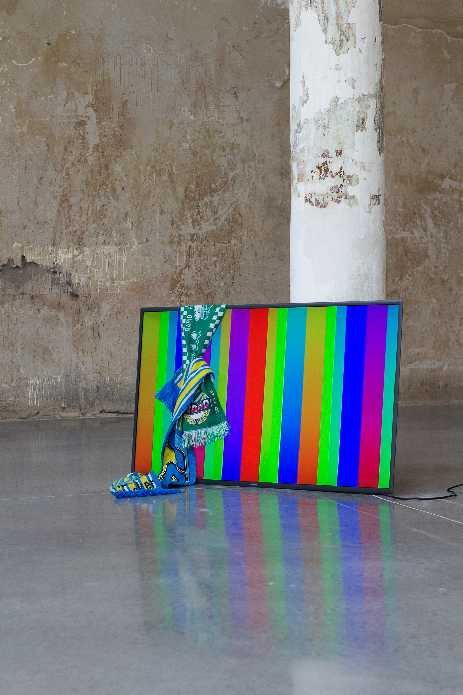
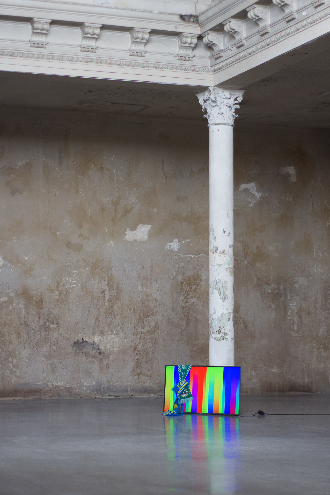
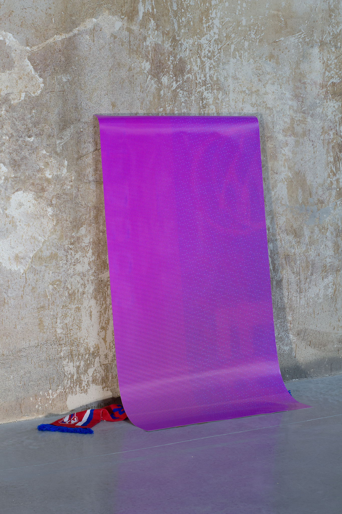
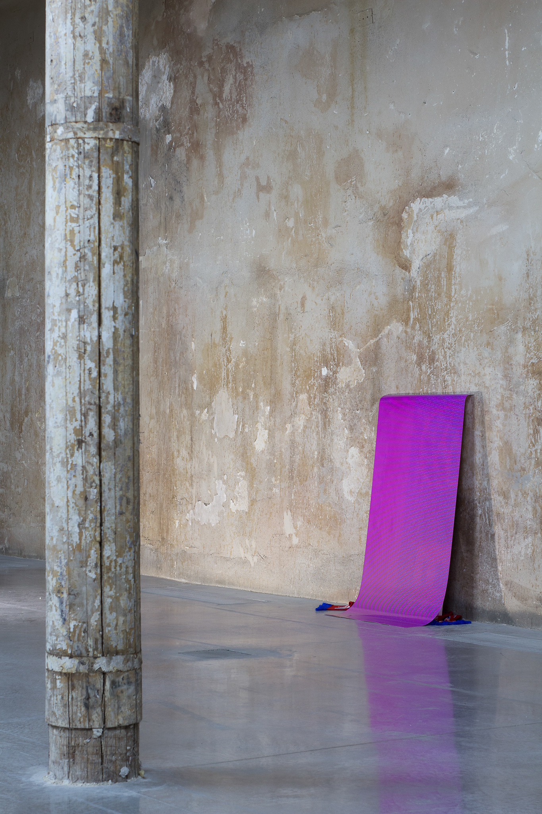

Date: 2018/02/19
Authors: Robin Niklas Höke
Keywords: Mixed Media, Monitor, Schal, Print

---
---

# flat earth

Unser Vertrauen in Speicher- und Anzeigemedien ist ambivalent. Wir verlassen uns auf technische Abläufen ohne konkretes Wissen darüber, was da  genau vor sich geht. Es herrscht ein gesellschaftliches Vertrauen in digitale Informations- und Kommunikationstechnologien. Doch visuelle Informationen können ausbleichen oder sich selbst reproduzieren, verbummeln und “nicht vergessen können“ geht auch digital. Verblassende Bilder gibt es vor, hinter und im Screen. Im additiven Farbraum RGB (rot, grün, blau) auf den die meisten Monitore setzen, so wie in unserer Alltäglichen Nutzung von Digitalen Formaten gibt es keine klare Grenze mehr. Digitale Tranzformation wird immer mehr von einer technischen- zu einer kulturellen Frage. Informationen müssen nur lange genug reizen und die elektronischen Ladungen pumpen diese weiter, Sender und Empfänger sind  ein und dasselbe geworden. Digitales Branding, All-Over Strukturen ohne klassisches Zentrum werden komplexer und sind dann doch nur Teil einer elektrisch angesteuerten Anzeige zur optischen Signalisierung von veränderbaren Informationen hinter einer dünnen Scheibe Plastik. Flat Earth. 

