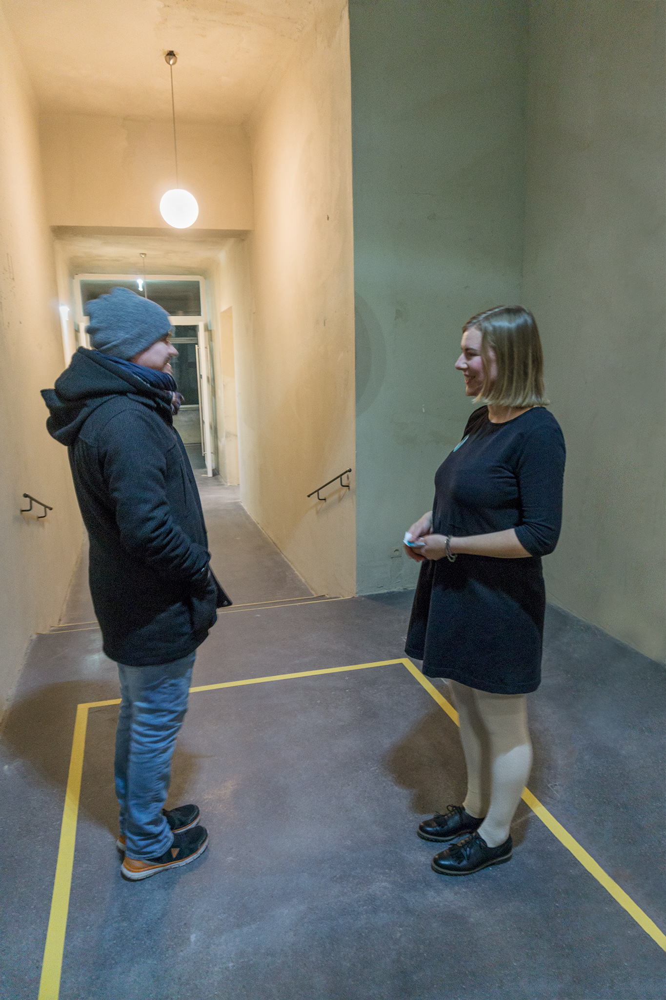

Date: 2018/02/19
Authors: Saskia Kaffenberger
Keywords: Performance, Installation, Klebeband, Sticker

---
---

# Differenzschwelle

>Man kann lesen, dass Souk-Händler in Marrakesch Vorübergehenden nachriefen:  
„Les gens pressés sont déjà morts.  („Menschen in Eile sind schon tot.“)

> Ilma Rakusa: „Langsamer!“, Graz – Wien, 2017, S. 57 f.

Die Besucher der Ausstellung werden am Eingang eingeladen fünf Atemzüge in dem gekennzeichneten Bereich der Schwelle zu verweilen, ohne sich zu unterhalten oder auf´s Smartphone zu sehen. So entsteht eine Unterbrechung, eine kleine Lücke in der Zeitwahrnehmung. Gedanken und Empfindungen werden die entstandene Lücke füllen oder bewusst machen wo die Besucher gerade sind und wie sie sich fühlen.
Nach den fünf Atemzügen wird der Sticker mit der Aufschrift: "Lass dir keinen Gedanken inkognito passieren",
überreicht, ein Zitat Walter Benjamins. Mit diesem Sticker erhalten die Besucher die Eintrittskarte zur Ausstellung. Sie sind jetzt, mit leiser Ironie, zum  ́Scholar der Schwellenkunde ́ ernannt - und können diese Erfahrung spielerisch beim Erreichen anderer Schwellen einsetzen.
Das kurze Innehalten und sich bewusst werden, überhaupt das deutlichere Empfinden von äußeren und inneren Schwellenbereichen, kann eine Wahrnehmungsschulung sein, welche die Besucher als kleines Experiment mitnehmen können.

